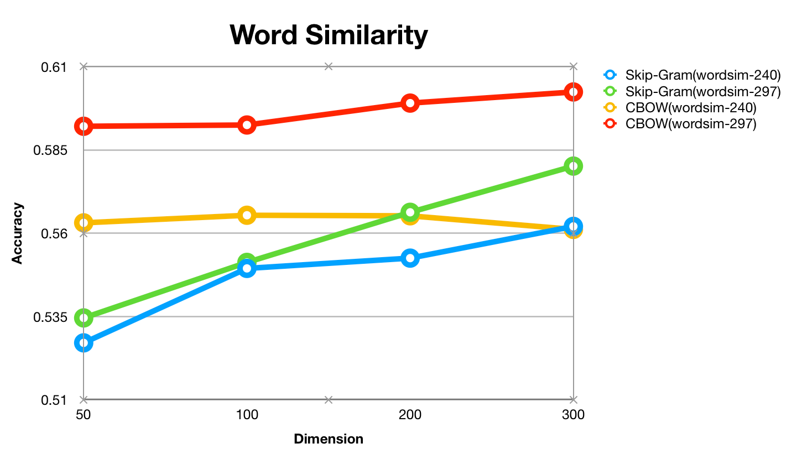
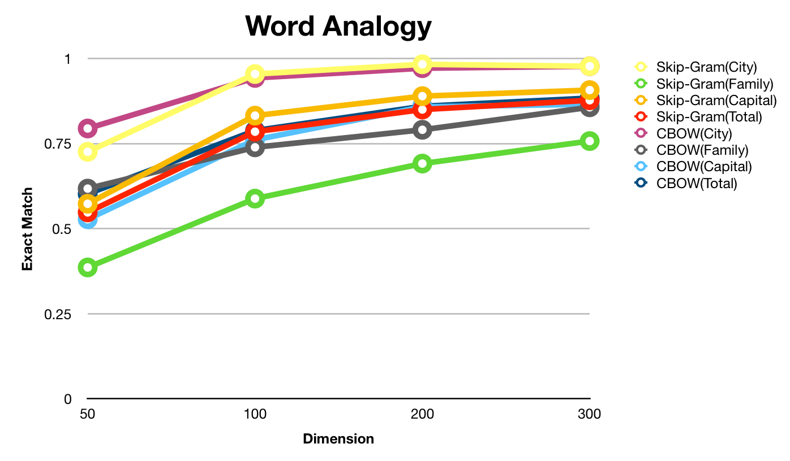
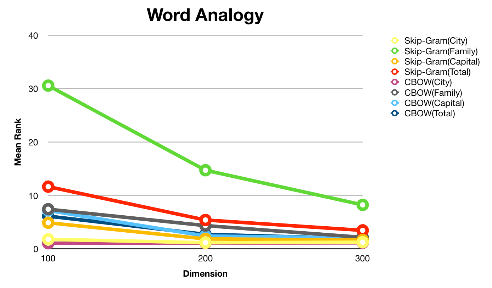
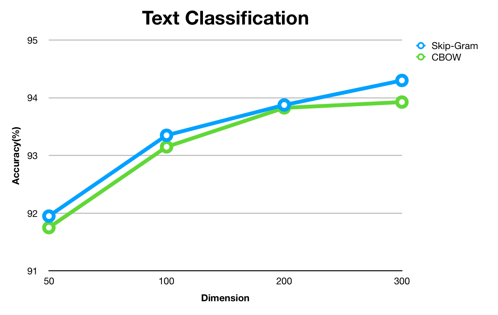
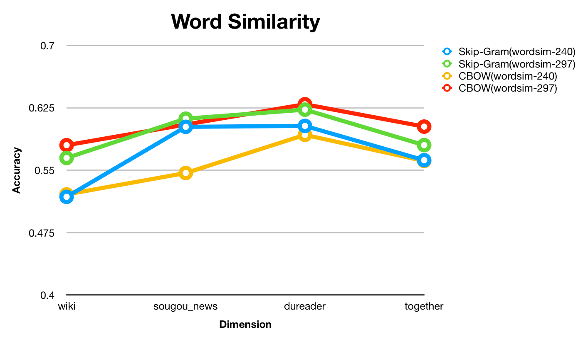
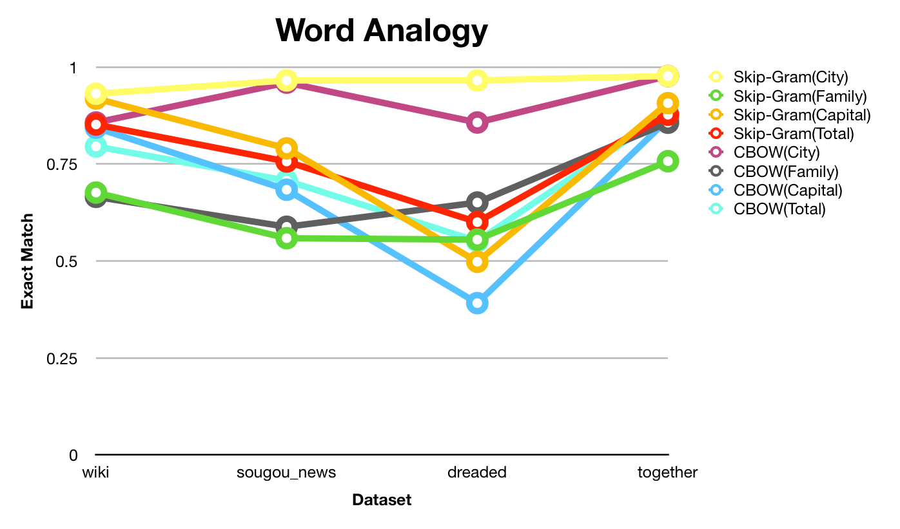
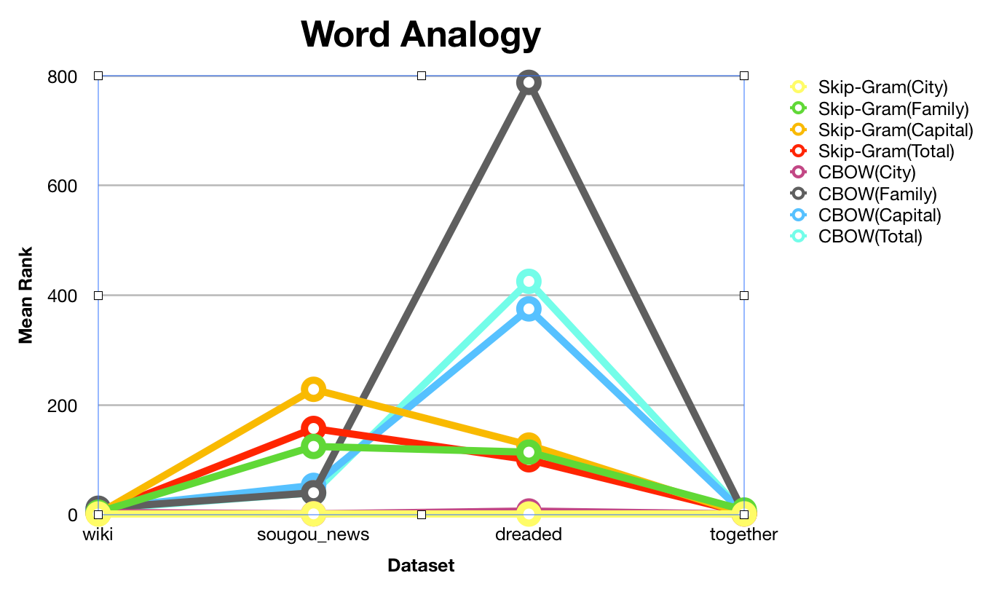
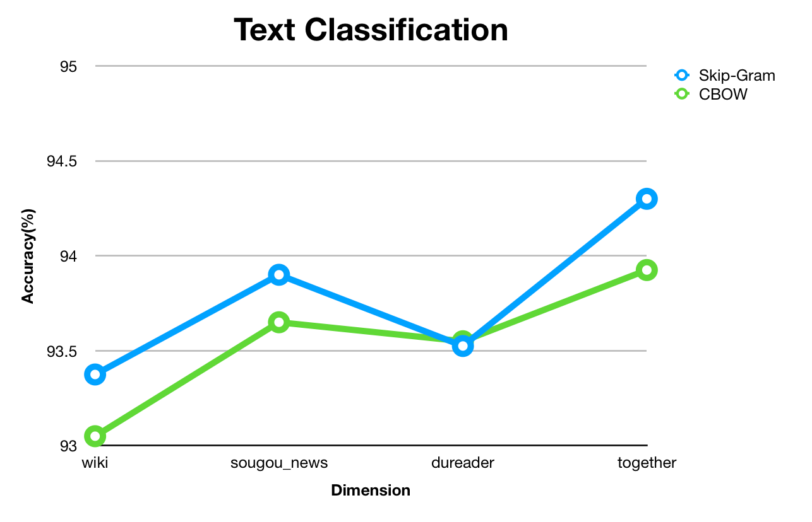

# **General Training Parameter**

| Parameter | Setting |
| :-: | :-: |
| corpus | {wiki, sougou_news, dureader, together} |
| model | {skip-gram, cbow} |
| vector dim | {50, 100, 200, 300} |
| context window size | 5 |
| word min count | 5 |
| subsampling | $10^{-4}$ |
| training | no hierarchical softmax, negative sample num 10 |
| iteration | 5(GLoVe 25) |
| initial learning rate | default |

# **Evaluation**

用CWE提供的240.txt，297.txt做word similarity，包含oov词的case直接忽略，不是把score赋为0。

用analogy.txt做word analog。

用THUCNews做文本分类，选取财经，教育，科技，社会，时政，体育，游戏，娱乐八大类，每类选5000篇文章用来训练，500篇用来测试，去除文章中数字和非中文字符，并且用ltp做分词，用LIBLINEAR来训练分类器，直接用train的默认参数。

# **Word2Vec**

## **wiki+sougou_news+dureader**

### **Skip-Gram**

```
 ./word2vec -train ../corpus/rm_digit_and_non_chinese/corpus.complete -output ../model/word2vec/wiki_sougou_news_dureader/word2vec_skip_gram_50.vec -size 50 -window 5 -sample 1e-
4 -hs 0 -negative 10 -iter 5 -min-count 5 -alpha 0.025 -cbow 0
```

**Word Similarity**

| Dataset | Found | Not Found | Score(Spearman Correlation) |
| :-: | :-: | :-: | :-: |
| 240.txt | 232 | 8 | 0.5270936654831673 |
| 297.txt | 287 | 10 | 0.5345762511845042 |

**Word Analogy**

Mean rank: 指ground truth在最近邻中排第几（理想情况应该是1）

| Category | Total count | Accuracy | Mean rank |
| :-: | :-: | :-: | :-: |
| City | 175 | 0.7257142857142858 | 8.942857142857143 |
| Family | 272 | 0.3860294117647059 | 338.96691176470586 |
| Capital | 506 | 0.5731225296442688 | 36.405138339920946 |
| Total | 953 | 0.5477439664218258 | 117.71773347324239 |

**文本分类**

Accuracy = 91.95%

```
./word2vec -train ../corpus/rm_digit_and_non_chinese/corpus.complete -output ../model/word2vec/wiki_sougou_news_dureader/word2vec_skip_gram_100.vec -size 100 -window 5 -sample 1
e-4 -hs 0 -negative 10 -iter 5 -min-count 5 -alpha 0.025 -cbow 0
```

**Word Similarity**

| Dataset | Found | Not Found | Score(Spearman Correlation) |
| :-: | :-: | :-: | :-: |
| 240.txt | 232 | 8 | 0.5494397040353125 |
| 297.txt | 287 | 10 | 0.5512445993563866 |

**Word Analogy**

Mean rank: 指ground truth在最近邻中排第几（理想情况应该是1）

| Category | Total count | Accuracy | Mean rank |
| :-: | :-: | :-: | :-: |
| City | 175 | 0.9542857142857143 | 1.7885714285714285 |
| Family | 272 | 0.5882352941176471 | 30.56985294117647 |
| Capital | 506 | 0.8320158102766798 | 4.899209486166008 |
| Total | 953 | 0.7848898216159497 | 11.654774396642182 |

**文本分类**

Accuracy = 93.35%

```
./word2vec -train ../corpus/rm_digit_and_non_chinese/corpus.complete -output ../model/word2vec/wiki_sougou_news_dureader/word2vec_skip_gram_200.vec -size 200 -window 5 -sample 1
e-4 -hs 0 -negative 10 -iter 5 -min-count 5 -alpha 0.025 -cbow 0
```

**Word Similarity**

| Dataset | Found | Not Found | Score(Spearman Correlation) |
| :-: | :-: | :-: | :-: |
| 240.txt | 232 | 8 | 0.5525256610613511 |
| 297.txt | 287 | 10 | 0.5662803562426717 |

**Word Analogy**

Mean rank: 指ground truth在最近邻中排第几（理想情况应该是1）

| Category | Total count | Accuracy | Mean rank |
| :-: | :-: | :-: | :-: |
| City | 175 | 0.9828571428571429 | 1.1657142857142857 |
| Family | 272 | 0.6911764705882353 | 14.727941176470589 |
| Capital | 506 | 0.8893280632411067 | 1.8754940711462451 |
| Total | 953 | 0.8499475341028332 |  5.413431269674711 |

**文本分类**

Accuracy = 93.875%

```
./word2vec -train ../corpus/rm_digit_and_non_chinese/corpus.complete -output ../model/word2vec/wiki_sougou_news_dureader/word2vec_skip_gram_300.vec -size 300 -window 5 -sample 1
e-4 -hs 0 -negative 10 -iter 5 -min-count 5 -alpha 0.025 -cbow 0
```

**Word Similarity**

| Dataset | Found | Not Found | Score(Spearman Correlation) |
| :-: | :-: | :-: | :-: |
| 240.txt | 232 | 8 | 0.5620540699478851 |
| 297.txt | 287 | 10 | 0.5801494826378228 |

**Word Analogy**

Mean rank: 指ground truth在最近邻中排第几（理想情况应该是1）

| Category | Total count | Accuracy | Mean rank |
| :-: | :-: | :-: | :-: |
| City | 175 | 0.9771428571428571 | 1.2457142857142858 |
| Family | 272 | 0.7573529411764706 | 8.242647058823529 |
| Capital | 506 | 0.9071146245059288 | 1.6719367588932805 |
| Total | 953 | 0.8772298006295908 | 3.4690451206715633 |

**文本分类**

Accuracy = 94.3%

### **CBOW**

```
./word2vec -train ../corpus/rm_digit_and_non_chinese/corpus.complete -output ../model/word2vec/wiki_sougou_news_dureader/word2vec_cbow_50.vec -size 50 -window 5 -sample 1e-4 -hs 0 -negative 10 -iter 5 -min-count 5 -alpha 0.05 -cbow 1
```

**Word Similarity**

| Dataset | Found | Not Found | Score(Spearman Correlation) |
| :-: | :-: | :-: | :-: |
| 240.txt | 232 | 8 | 0.5631174805518439 |
| 297.txt | 287 | 10 | 0.592098194827001 |

**Word Analogy**

Mean rank: 指ground truth在最近邻中排第几（理想情况应该是1）

| Category | Total count | Accuracy | Mean rank |
| :-: | :-: | :-: | :-: |
| City | 175 | 0.7942857142857143 | 2.0171428571428573 |
| Family | 272 | 0.6176470588235294 | 19.74264705882353 |
| Capital | 506 | 0.5276679841897233 | 67.2411067193676 |
| Total | 953 | 0.60230849947534 | 41.70724029380902 |

**文本分类**

Accuracy = 91.75%

```
./word2vec -train ../corpus/rm_digit_and_non_chinese/corpus.complete -output ../model/word2vec/wiki_sougou_news_dureader/word2vec_cbow_100.vec -size 100 -window 5 -sample 1e-4 -hs 0 -negative 10 -iter 5 -min-count 5 -alpha 0.05 -cbow 1
```

**Word Similarity**

| Dataset | Found | Not Found | Score(Spearman Correlation) |
| :-: | :-: | :-: | :-: |
| 240.txt | 232 | 8 | 0.565393265739529 |
| 297.txt | 287 | 10 | 0.5924817049087362 |

**Word Analogy**

Mean rank: 指ground truth在最近邻中排第几（理想情况应该是1）

| Category | Total count | Accuracy | Mean rank |
| :-: | :-: | :-: | :-: |
| City | 175 | 0.9428571428571428 | 1.0685714285714285 |
| Family | 272 | 0.7389705882352942 | 7.430147058823529 |
| Capital | 506 | 0.7608695652173914 | 7.191699604743083 |
| Total | 953 | 0.7880377754459601 | 6.135362014690451 |

**文本分类**

Accuracy = 93.15%

```
./word2vec -train ../corpus/rm_digit_and_non_chinese/corpus.complete -output ../model/word2vec/wiki_sougou_news_dureader/word2vec_cbow_200.vec -size 200 -window 5 -sample 1e-4 -hs 0 -negative 10 -iter 5 -min-count 5 -alpha 0.05 -cbow 1
```

**Word Similarity**

| Dataset | Found | Not Found | Score(Spearman Correlation) |
| :-: | :-: | :-: | :-: |
| 240.txt | 232 | 8 | 0.5652217168983128 |
| 297.txt | 287 | 10 | 0.5990539154027475 |

**Word Analogy**

Mean rank: 指ground truth在最近邻中排第几（理想情况应该是1）

| Category | Total count | Accuracy | Mean rank |
| :-: | :-: | :-: | :-: |
| City | 175 | 0.9714285714285714 | 1.0914285714285714 |
| Family | 272 | 0.7904411764705882 | 4.363970588235294 |
| Capital | 506 | 0.857707509881423 | 2.4130434782608696 |
| Total | 953 | 0.8593913955928646 | 2.7271773347324237 |

**文本分类**

Accuracy = 93.825%

```
./word2vec -train ../corpus/rm_digit_and_non_chinese/corpus.complete -output ../model/word2vec/wiki_sougou_news_dureader/word2vec_cbow_300.vec -size 300 -window 5 -sample 1e-4 -hs 0 -negative 10 -iter 5 -min-count 5 -alpha 0.05 -cbow 1
```

**Word Similarity**

| Dataset | Found | Not Found | Score(Spearman Correlation) |
| :-: | :-: | :-: | :-: |
| 240.txt | 232 | 8 | 0.5611410649105956 |
| 297.txt | 287 | 10 | 0.6023986267760679 |

**Word Analogy**

Mean rank: 指ground truth在最近邻中排第几（理想情况应该是1）

| Category | Total count | Accuracy | Mean rank |
| :-: | :-: | :-: | :-: |
| City | 175 | 0.9771428571428571 | 1.1485714285714286 |
| Family | 272 | 0.8566176470588235 | 2.1654411764705883 |
| Capital | 506 | 0.8656126482213439 | 2.0652173913043477 |
| Total | 953 | 0.8835257082896117 | 1.925498426023085 |

**文本分类**

Accuracy = 93.925%

## **wiki**

### **Skip-Gram**

```
./word2vec -train ../corpus/rm_digit_and_non_chinese/wiki_zh.corpus.complete -output ../model/word2vec/wiki/word2vec_skip_gram_300.vec -size 300 -window 5 -sample 1e-4 -hs 0 -negative 10 -iter 5 -min-count 5 -alpha 0.025 -cbow 0
```

**Word Similarity**

| Dataset | Found | Not Found | Score(Spearman Correlation) |
| :-: | :-: | :-: | :-: |
| 240.txt | 232 | 8 | 0.5180462660925949 |
| 297.txt | 287 | 10 | 0.5647306514297937 |

**Word Analogy**

Mean rank: 指ground truth在最近邻中排第几（理想情况应该是1）

| Category | Total count | Accuracy | Mean rank |
| :-: | :-: | :-: | :-: |
| City | 175 | 0.9314285714285714 | 1.0857142857142856 |
| Family | 272 | 0.6764705882352942 | 4.224264705882353 |
| Capital | 506 | 0.9189723320158103 | 1.7134387351778657 |
| Total | 953 | 0.8520461699895068 | 2.3147953830010493 |

**文本分类**

Accuracy = 93.375%

### **CBOW**

```
./word2vec -train ../corpus/rm_digit_and_non_chinese/wiki_zh.corpus.complete -output ../model/word2vec/wiki/word2vec_cbow_300.vec -size 300 -window 5 -sample 1e-4 -hs 0 -negative 10 -iter 5 -min-count 5 -alpha 0.05 -cbow 1
```

**Word Similarity**

| Dataset | Found | Not Found | Score(Spearman Correlation) |
| :-: | :-: | :-: | :-: |
| 240.txt | 232 | 8 | 0.5209698043277894 |
| 297.txt | 287 | 10 | 0.580055572161157 |

**Word Analogy**

Mean rank: 指ground truth在最近邻中排第几（理想情况应该是1）

| Category | Total count | Accuracy | Mean rank |
| :-: | :-: | :-: | :-: |
| City | 175 | 0.8571428571428571 | 3.8457142857142856 |
| Family | 272 | 0.6654411764705882 | 11.544117647058824 |
| Capital | 506 | 0.8438735177865613 | 10.855731225296443 |
| Total | 953 | 0.7953830010493179 | 9.76495278069255 |

**文本分类**

Accuracy = 93.05%

## **sougou_news**

### **Skip-Gram**

```
./word2vec -train ../corpus/rm_digit_and_non_chinese/sougou_news.corpus.complete -output ../model/word2vec/sougou_news/word2vec_skip_gram_300.vec -size 300 -window 5 -sample 1e-4 -hs 0 -negative 10 -iter 5 -min-count 5 -alpha 0.025 -cbow 0
```

**Word Similarity**

| Dataset | Found | Not Found | Score(Spearman Correlation) |
| :-: | :-: | :-: | :-: |
| 240.txt | 231 | 9 | 0.6021436605736398 |
| 297.txt | 282 | 15 | 0.6119378446032147 |

**Word Analogy**

Mean rank: 指ground truth在最近邻中排第几（理想情况应该是1）

| Category | Total count | Accuracy | Mean rank |
| :-: | :-: | :-: | :-: |
| City | 175 | 0.9657142857142857 | 1.36 |
| Family | 272 | 0.5588235294117647 | 124.29411764705883 |
| Capital | 506 | 0.7905138339920948 | 228.50395256916997 |
| Total | 953 | 0.7565582371458552 | 157.05036726128017 |

**文本分类**

Accuracy = 93.9%

### **CBOW**

```
 ./word2vec -train ../corpus/rm_digit_and_non_chinese/sougou_news.corpus.complete -output ../model/word2vec/sougou_news/word2vec_cbow_300.vec -size 300 -window 5 -sample 1e-4 -hs 0 -negative 10 -iter 5 -min-count 5 -alpha 0.05 -cbow 1
```

**Word Similarity**

| Dataset | Found | Not Found | Score(Spearman Correlation) |
| :-: | :-: | :-: | :-: |
| 240.txt | 231 | 9 | 0.5466526866813156 |
| 297.txt | 282 | 15 | 0.6049431883193874 |

**Word Analogy**

Mean rank: 指ground truth在最近邻中排第几（理想情况应该是1）

| Category | Total count | Accuracy | Mean rank |
| :-: | :-: | :-: | :-: |
| City | 175 | 0.96 | 1.4285714285714286 |
| Family | 272 | 0.5882352941176471 | 39.875 |
| Capital | 506 | 0.6837944664031621 | 53.25494071146245 |
| Total | 953 | 0.7072402938090241 | 39.919202518363065 |

**文本分类**

Accuracy = 93.65%

## **dureader**

### **Skip-Gram**

```
./word2vec -train ../corpus/rm_digit_and_non_chinese/dureader.corpus.complete -output ../model/word2vec/dureader/word2vec_skip_gram_300.vec -size 300 -window 5 -sample 1e-4 -hs 0 -negative 10 -iter 5 -min-count 5 -alpha 0.025 -cbow 0
```

**Word Similarity**

| Dataset | Found | Not Found | Score(Spearman Correlation) |
| :-: | :-: | :-: | :-: |
| 240.txt | 232 | 8 | 0.6032608704545644 |
| 297.txt | 287 | 10 | 0.6227992896320516 |

**Word Analogy**

Mean rank: 指ground truth在最近邻中排第几（理想情况应该是1）

| Category | Total count | Accuracy | Mean rank |
| :-: | :-: | :-: | :-: |
| City | 175 | 0.9657142857142857 | 1.0457142857142858 |
| Family | 272 | 0.5551470588235294 | 113.90073529411765 |
| Capital | 506 | 0.4980237154150198 | 126.76284584980237 |
| Total | 953 | 0.6002098635886673 | 100.00629590766002 |

**文本分类**

Accuracy = 93.525%

### **CBOW**

```
./word2vec -train ../corpus/rm_digit_and_non_chinese/dureader.corpus.complete -output ../model/word2vec/dureader/word2vec_cbow_300.vec -size 300 -window 5 -sample 1e-4 -hs 0 -negative 10 -iter 5 -min-count 5 -alpha 0.05 -cbow 1
```

**Word Similarity**

| Dataset | Found | Not Found | Score(Spearman Correlation) |
| :-: | :-: | :-: | :-: |
| 240.txt | 232 | 8 | 0.5924979826518215 |
| 297.txt | 287 | 10 | 0.6292622977681703 |

**Word Analogy**

Mean rank: 指ground truth在最近邻中排第几（理想情况应该是1）

| Category | Total count | Accuracy | Mean rank |
| :-: | :-: | :-: | :-: |
| City | 175 | 0.8571428571428571 | 6.474285714285714 |
| Family | 272 | 0.6507352941176471 | 788.2683823529412 |
| Capital | 506 | 0.391304347826087 | 375.201581027668 |
| Total | 953 | 0.5508919202518363 | 425.3871983210913 |

**文本分类**

Accuracy = 93.55%

## **Analysis**

wiki+sougou_news+dureader数据集不同向量维度的分析





remove dimension 50 because its mean rank is too large





不同数据集的分析（向量维度都是300）









# **GloVe**

## **wiki+sougou_news+dureader**

```
#!/bin/bash
set -e

CORPUS=../corpus/rm_digit_and_non_chinese/corpus.complete
SAVE_FILE=../model/glove/wiki_sougou_news_dureader/glove_300

VOCAB_FILE=vocab.txt
COOCCURRENCE_FILE=cooccurrence.bin
COOCCURRENCE_SHUF_FILE=cooccurrence.shuf.bin
BUILDDIR=build
VERBOSE=2
MEMORY=15.5
VOCAB_MIN_COUNT=5
VECTOR_SIZE=300
WINDOW_SIZE=5
BINARY=0
NUM_THREADS=8

echo "$ $BUILDDIR/vocab_count -min-count $VOCAB_MIN_COUNT -verbose $VERBOSE < $CORPUS > $VOCAB_FILE"
$BUILDDIR/vocab_count -min-count $VOCAB_MIN_COUNT -verbose $VERBOSE < $CORPUS > $VOCAB_FILE
echo "$ $BUILDDIR/cooccur -memory $MEMORY -vocab-file $VOCAB_FILE -verbose $VERBOSE -window-size $WINDOW_SIZE < $CORPUS > $COOCCURRENCE_FILE"
$BUILDDIR/cooccur -memory $MEMORY -vocab-file $VOCAB_FILE -verbose $VERBOSE -window-size $WINDOW_SIZE < $CORPUS > $COOCCURRENCE_FILE
echo "$ $BUILDDIR/shuffle -memory $MEMORY -verbose $VERBOSE < $COOCCURRENCE_FILE > $COOCCURRENCE_SHUF_FILE"
$BUILDDIR/shuffle -memory $MEMORY -verbose $VERBOSE < $COOCCURRENCE_FILE > $COOCCURRENCE_SHUF_FILE
echo "$ $BUILDDIR/glove -write-header 1 -model 1 -save-file $SAVE_FILE -threads $NUM_THREADS -input-file $COOCCURRENCE_SHUF_FILE -vector-size $VECTOR_SIZE -binary $BINARY -vocab-file $VOCAB_FILE -verbose $VE    RBOSE"
$BUILDDIR/glove -write-header 1 -model 1 -save-file $SAVE_FILE -threads $NUM_THREADS -input-file $COOCCURRENCE_SHUF_FILE -vector-size $VECTOR_SIZE -binary $BINARY -vocab-file $VOCAB_FILE -verbose $VERBOSE
```

**Word Similarity**

| Dataset | Found | Not Found | Score(Spearman Correlation) |
| :-: | :-: | :-: | :-: |
| 240.txt | 232 | 8 | 0.5468020805354796 |
| 297.txt | 287 | 10 | 0.5147933094143985 |

**Word Analogy**

Mean rank: 指ground truth在最近邻中排第几（理想情况应该是1）

| Category | Total count | Accuracy | Mean rank |
| :-: | :-: | :-: | :-: |
| City | 175 | 0.9428571428571428 | 1.1028571428571428 |
| Family | 272 | 0.6875 | 23.790441176470587 |
| Capital | 506 | 0.6996047430830039 | 2.877470355731225 |
| Total | 953 | 0.7408184679958028 | 8.520461699895069 |

**文本分类**

Accuracy = 93.625%

# **fastText**

## **wiki+sougou_news+dureader**

### **Skip-Gram**

```
./fasttext skipgram -input ../corpus/rm_digit_and_non_chinese/corpus.complete -output ../model/fasttext/wiki_sougou_news_dureader/fasttext_skip_gram_300 -minCount 5 -minn 1 -maxn 6 -t 0.0001 -lr 0.025 -dim 300 -ws 5 -neg 10 -loss ns -thread 3
```

**Word Similarity**

Preprocess in order to compute all word vector

```
cut -f 1,2 ../CWE/data/240.txt | awk '{print tolower($0)}' | tr '\t' '\n' > queries.txt
cat queries.txt | ../fastText/fasttext print-word-vectors ../model/fasttext/wiki_sougou_news_dureader/fasttext_skip_gram_300.bin > vectors.txt

cut -f 1,2 ../CWE/data/297.txt | awk '{print tolower($0)}' | tr '\t' '\n' > queries.txt
cat queries.txt | ../fastText/fasttext print-word-vectors ../model/fasttext/wiki_sougou_news_dureader/fasttext_skip_gram_300.bin > vectors.txt
```

| Dataset | Found | Not Found | Score(Spearman Correlation) |
| :-: | :-: | :-: | :-: |
| 240.txt | 240 | 0 | 0.5775802337578299 |
| 297.txt | 296 | 1 | 0.6185255346335059 |

**Word Analogy**

Preprocess to get oov embedding

Mean rank: 指ground truth在最近邻中排第几（理想情况应该是1）

| Category | Total count | Accuracy | Mean rank |
| :-: | :-: | :-: | :-: |
| City | 175 | 0.9771428571428571 | 1.062857142857143 |
| Family | 272 | 0.4411764705882353 | 14.022058823529411 |
| Capital | 506 | 0.5434782608695652 | 36.24308300395257 |
| Total | 953 | 0.5939139559286464 | 23.440713536201468 |

**文本分类**

Preprocess in order to compute all word vector

Accuracy = 94.15%

### **CBOW**

```
./fasttext cbow -input ../corpus/rm_digit_and_non_chinese/corpus.complete -output ../model/fasttext/wiki_sougou_news_dureader/fasttext_cbow_300 -minCount 5 -minn 1 -maxn 6 -t 0.0001 -lr 0.05 -dim 300 -ws 5 -neg 10 -loss ns -thread 3
```

**Word Similarity**

Preprocess in order to compute all word vector

```
cut -f 1,2 ../CWE/data/240.txt | awk '{print tolower($0)}' | tr '\t' '\n' > queries.txt
cat queries.txt | ../fastText/fasttext print-word-vectors ../model/fasttext/wiki_sougou_news_dureader/fasttext_cbow_300.bin > vectors.txt

cut -f 1,2 ../CWE/data/297.txt | awk '{print tolower($0)}' | tr '\t' '\n' > queries.txt
cat queries.txt | ../fastText/fasttext print-word-vectors ../model/fasttext/wiki_sougou_news_dureader/fasttext_cbow_300.bin > vectors.txt
```

| Dataset | Found | Not Found | Score(Spearman Correlation) |
| :-: | :-: | :-: | :-: |
| 240.txt | 240 | 0 | 0.5900611487697095 |
| 297.txt | 296 | 1 | 0.6343481072884735 |

**Word Analogy**

Preprocess to get oov embedding

Mean rank: 指ground truth在最近邻中排第几（理想情况应该是1）

| Category | Total count | Accuracy | Mean rank |
| :-: | :-: | :-: | :-: |
| City | 175 |  |  |
| Family | 272 |  |  |
| Capital | 506 |  |  |
| Total | 953 |  |  |

**文本分类**

Preprocess in order to compute all word vector

Accuracy = 93.85%

# **CWE**

# **SCWE**

# **JWE**

# **Some algorithm can use pretrained embedding to improve?**
