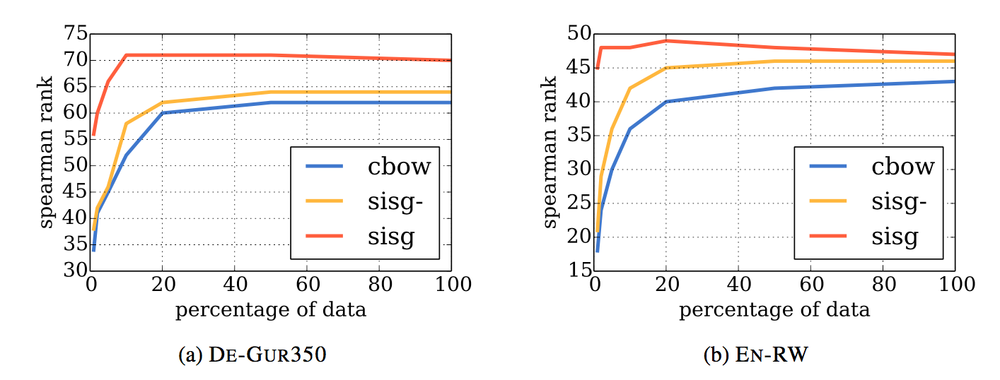
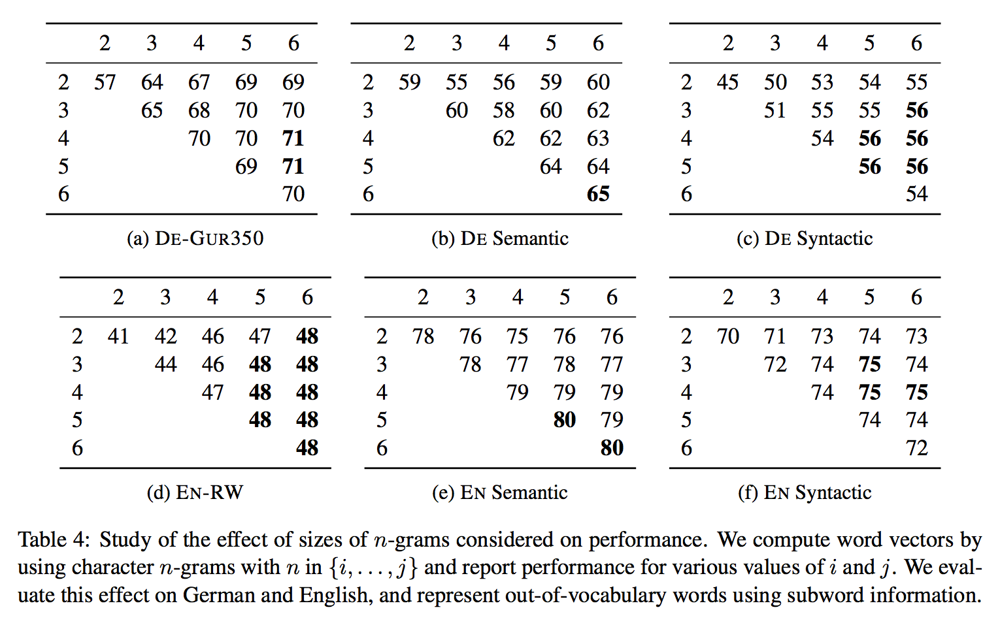

# **fastText**

## **介绍**

提出学习n-gram的向量表示，然后通过求n-gram的和来表示词，主要是改进了Skip-gram模型，增加了subword信息。

## **模型**

### **基于negative sampling的skip-gram模型**

函数$s$表示词和上下文的得分，基于negative sampling的skip-gram模型的优化目标如下：

$$
\sum_{t=1}^{T}[\sum_{c\in C_t}\log(1+\exp(-s(w_t, w_c)))+\sum_{n\in N_{t,c}}\log(1+\exp(s(w_t, n)))]
$$

$u_w, v_w$分别是词$w$的input和output向量，其中$s(w_t, w_c)=u_{w_t}^T v_{w_c}$

**Subword模型**

主要改变$s$函数来包含subword信息

每个词$w$表示为character n-gram的词袋，并且添加特殊边界符号<和>在词的开头和结尾，同时也把词$w$自身包含在词袋中，例如词where在n=3时，词袋包含：<wh,whe,her,ere,re>和\<where>。实际中提取n>=3和n<=6的所有character n-gram。

$G_w$表示词$w$词袋的集合，$z_g$表示相应的character n-gram。词$w$表示为所有n-grams的和，并令

$$
s(w, c) = \sum_{g\in G_w}z_g^Tv_c
$$

这个简单的模型能够在词之间共享表示，因此能够学习罕见词的表示。

为了限制模型的内存占用，用Fowler-Noll-Vo哈希函数将n-grams映射到1-K。

## **评价方法**

和word2vec的skip-gram和cbow比较，主要比较word similarity和word analogies

## **结果**

处理out-of-vocabulary词时，使用求n-grams和作为表示的是sisg模型，使用零向量去表示的是sisg-模型。

### **word similarity**

sisg基本好于word2vec，然后sisg不会差于sisg-，说明subword信息还是有用的。和其他用到morphological表示的方法比较也是最好的。

### **word analogy**

对于syntactic任务,sisg明显好于word2vec，但是在semantic任务上，sisg比word2vec差，这很可能是因为character n-grams长度选择的问题，在最优长度下，差得最少。

### **训练数据大小的影响**

sisg是最好的，但是cbow在数据越来越多时效果越来越好，而sisg随着数据变多，效果却不总是变好。

sisg在小数据下能够得到很好的词向量，在实际使用中，任务相关的数据很少，但用sisg方法得到的词向量能够很好解决oov的问题

### **n-grams大小的影响**

n-grams长度在3-6是个不错的选择，但是具体任务具体语言还要进一步调参。

n>=3的结果总是好于n>=2，可能由于n=2太短了，而且边界符<和>通常会占一位。

### **语言模型**

用sisg训练的词向量初始化的语言模型效果最好。

## **定量分析**

最重要的n-gram很可能就是morphemes

对于oov词的相似性，subword之间的匹配很好的代表了词之间的匹配

## **感想**

fastText对于词的morphology很重要，能够通过character n-grams捕捉prefix,suffix和morphemes等subword信息。但是中文我觉得形态学并不是很丰富，不知道会不会有很大作用。但也可以把中文字细分为偏旁部首，这样说不定会有一定形态学，fastText可能会更好。

## **参考文献**

[Enriching Word Vectors with Subword Information](https://arxiv.org/pdf/1607.04606.pdf)