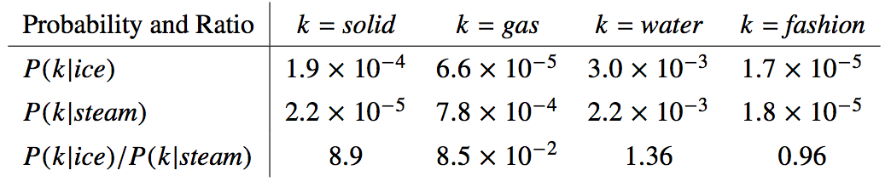
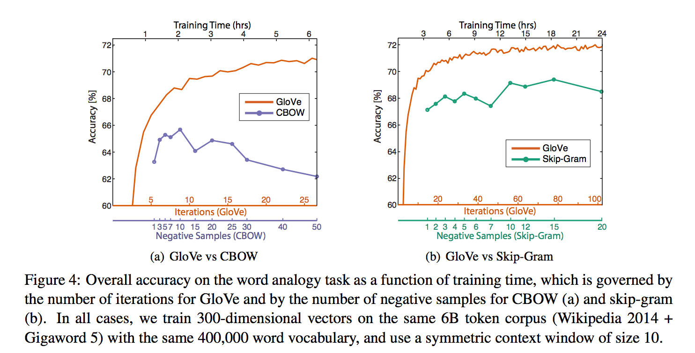

# **GloVe**

## **动机**

学习词向量有两大类方法：1）类似latent semantic analysis的全局矩阵分解;2)类似skip-gram的局部上下文窗口。这两种方法都有一些缺陷，全局矩阵分解有效利用了统计信息，但是在word analogy任务上表现很差，暗示了向量空间结构不是最优的，类似skip-gram的方法在word analogy上表现很好，但是没有充分利用统计信息。

GloVe结合两类方法，提出了在全局词共现矩阵上训练的加权最小二乘模型，保证了统计信息的充分利用，并且在word analogy上的指标超越了word2vec。

## **模型**

符号介绍：$X$表示词共现矩阵，其中矩阵元素$X_{ij}$表示词$j$出现在词$i$上下文中的次数。$X_i=\sum_k X_{ik}$表示任何词出现在词$i$上下文中的次数。$P_{ij}=P(j|i)=X_{ij}/X_i$表示词$j$出现在词$i$上下文的概率。

模型基于以下简单例子：例如词$i$=ice，词$j$=steam，如果词$k$接近于ice不接近steam,那么$P_{ik}/P_{jk}$应该比较大，如果词$k$接近于steam不接近ice,那么$P_{ik}/P_{jk}$应该比较小，如果词$k$同时接近ice和steam或者都不接近，那么$P_{ik}/P_{jk}$应该接近1。

相比于原始概率$P_i$，概率的比例更适合把相关的词（solid,gas）和不相关的词（water,fashion）区分开，并且更容易在相关词中进行判别。

根据以上经验可以得到一般模型：

$$
F(w_i, w_j, \hat{w_k})=\frac{P_{ik}}{P_{jk}}
$$ (1)

首先F函数应该在词向量空间编码了$P_{ik}/P_{jk}$的信息，因为目标向量空间应该是线性的，最自然的方法是取两个向量的差。

$$
F(w_i-w_j, \hat{w_k})=\frac{P_{ik}}{P_{jk}}
$$ (2)

接下来（2）中F的参数是向量而值为标量，但是F可能是有复杂的参数控制，例如神经网络，这样的话会干扰我们捕捉线性结构，因此我们取参数的点积。

$$
F((w_i-w_j)^T\hat{w_k})=\frac{P_{ik}}{P_{jk}}
$$ (3)

接下来，词和context的角色应该是任意可换的，为了实现对称性，首先需要F在$(R, +)$和$(R_{>0}, \times)$组上是homomorphism的。

$$
F((w_i-w_j)^T\hat{w_k})=\frac{F({w_i}^T\hat{w_k})}{F({w_j}^T\hat{w_k})}
$$ (4)

由于(3)，应该有如下

$$
F({w_i}^T\hat{w_k})=P_{ik}=\frac{X_{ik}}{X_i}
$$ (5)

(4)的解为$F=\exp$，

$$
{w_i}^T\hat{w_k}=\log(P_{ik})=\log(X_{ik})-\log(X_i)
$$ (6)

最后，(6)中如果没有$\log(X_i)$，那么将满足交换性。$\log(X_i)$这一项和$k$无关，可以用$b_i$表示，同样增加$\hat{b_k}$来满足对称性。

$$
{w_i}^T\hat{w_k}+b_i+\hat{b_k}=\log(X_{ik})
$$ (7)

(7)是(1)的极大简化，但是由于$log$在0附近的发散，导致(7)是ill-defined，一种解决方法是添加一个位移,$\log(X_{ik})\rightarrow\log(1+X_{ik})$。

模型(7)还有一个缺点是他对于词共现的权重是一样的，即使有些极少出现甚至不出现，这些极少出现的词共现很可能是噪声，相对频繁的词共现携带极少的有用信息。因此又提出加权最小二乘回归模型来解决这个问题。

$$
J=\sum_{i,j=1}^{V}f(X_{ij})({w_i}^T\hat{w_j}+b_i+\hat{b_j}-\log(X_{ij}))^2
$$ (8)

其中函数$f$应满足以下特性：1）$f(0)=0$；2）$f(x)$应该是non-decreasing；3）对于比较大的$x$，$f(x)$应该相对较小。一个效果还不错的$f$如下：

$$
f(x)=\begin{cases}
        (x/x_{max})^\alpha & if\ x < x_{max} \\
        1 & otherwise
    \end{cases}
$$ (9)

.png)

其中截断对于模型的性能的影响很小，设置$x_{max}=100$，然后$\alpha=3/4$比线性$\alpha=1$要好

## **评价方法**

在五个不同大小语料上分别比较Word analogie，Word similarity和Named entity recognition的性能。

## **结果**

上下文窗口同时从左右延伸的称为对称的，只从左边延伸的称为不对称的。当向量维度大于200时，性能提升很小。对于syntactic sub-task，小的不对称窗口效果更好，对于semantic sub-task，小窗口下对称比不对称好，大窗口更好，对不对称区别也不大。

对于syntactic sub-task，语料越大越好，对于semantic sub-task，不一定语料越大越好，语料的domain相关性更重要

和word2vec比较见下图：

## **参考文献**

[GloVe: Global Vectors for Word Representation](https://nlp.stanford.edu/pubs/glove.pdf)