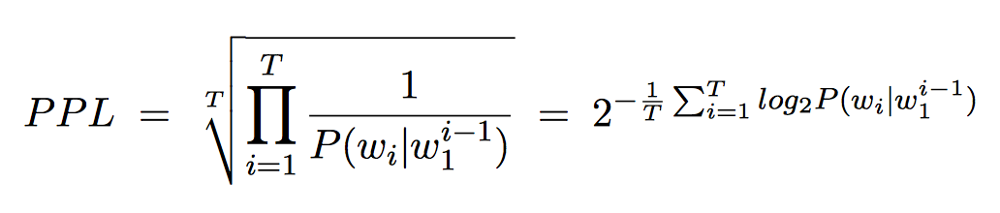
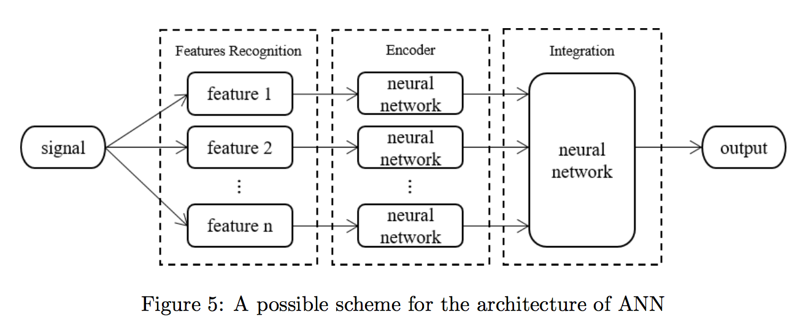

# **[A Study on Neural Network Language Modeling](https://arxiv.org/pdf/1708.07252.pdf)**

## **神经语言模型基础** ##

统计语言模型的目标是预测自然语言中词序列$w_1 w_2 ... w_T$的概率，这个概率可以转换为根据前面的词预测当前词的条件概率的积：

$$
P(w_1^T) = \prod_{t=1}^T P(w_t|w_1^{t-1})
$$

其中$w_i^j=w_i w_{i+1} ... w_{j-1} w_j$，这个链式规则是建立在假设词序列中的词只依赖它之前的词，这是整个统计语言模型的基础。神经语言模型(NNLM)是一种统计语言模型，下面介绍主要几种NNLM

### **Feed-forward神经语言模型，FNNLM**

将Feed-forward神经网络和n-gram结合，假设一个词只依赖他前面$n-1$个词。

语言模型的性能由perplexity(PPL)衡量：

### **RNN和LSTM神经语言模型**

分别用RNN和LSTM的神经语言模型

### **实验结果**

在小语料上RNNLM和LSTMLM并不比FNNLM要好，LSTMLM的PPL反而更差。

## **优化技术** ##

### **Importance Sampling** ###

https://blog.csdn.net/Dark_Scope/article/details/70992266

### **Word Classes** ###

词典中每个词被赋予唯一一个类，这样一个词根据之前词的条件概率可以分解为根据之前词预测这个词所属类的概率和根据之前词和这个词所属类预测这个词的概率：

$$
P(w_t|w_1^{t-1}) = P(w_t|c(w_t), w_1^{t-1})P(c(w_t)|w_1^{t-1})
$$

然后又有hierarchical binary clustering of words，感觉有点像然后又有hierarchical softmax，具体也没看得很懂，见原文。

### **Caching**

这个方法假设之前出现过的词很有可能再次出现，语言模型的概率由标准语言模型的输出和caching输出插值得到：

$$
P(w_t|w_0^{t-1})=\lambda P_o (w_t|w_0^{t-1}) + (1-\lambda)P_c (w_t|w_0^{t-1})
$$

具体见原文，不是很懂。

### **双向RNN**

根据前面和后面的词一起预测当前的词，这也更符号人做填空题的直觉，根据前后的词才能推断当前可能什么词。

## **神经语言模型的局限**

### **模型架构**

语言模型根据前面或者后面的词一个一个的预测当前词，但是人在说话时，都是脑子里已经想好了要说什么，然后说出来，不是说了前面的词才开始想下面一个词说什么的。而且人在阅读或者听力时都是根据前后的词来判断当前词的意思或者词性，而不只是根据一侧去判断。

神经网络只有更加复杂，参数更多，效果才能更好，但是这样训练又很麻烦，这就很矛盾。因此可以尝试下图这种结构

首先根据具体领域知识提取信号特征，然后每个特征用一个精心设计的不变的网络去编码，这个不变的网络可以很复杂，最后编码后的特征在通过一个可以训练的网络得到输出。

### **知识表示**

神经语言模型学习的只不过是词序列的概率分布，而且严格来说是训练语料中词序列的概率分布，而不是一个通用的概率分布。而且实验表明用领域相关的语料训练的结果比用大量语料既有领域相关又有不相关的结果要好。因此神经网络密性既不能学习语法也不能学习语义，只能学习训练语料的词序列的概率分布。因此神经语言模型可以用在不需要语言理解的任务上。

神经语言模型也不能在原来基础上继续学习新的语料，只能把原来语料和新的语料合起来一起重新训练，即神经语言模型不具备像人一样持续学习的能力。

## **未来工作**

优化方法中还有GRU, dropout等可以探索。

还没想到比较好的能够解决语言理解的网络结构，不过上面提到的架构可以尝试，主要是考虑如何实现不变的encoder。

实际上自然语言时人造的，语言学特征也是自然语言出现后很久人创造的。语言学特征只是说明了哪些词序列是对的，但是正常口语很多都不严格符合语言学特征。实际上，自然语言只不过是用来表示实际世界中抽象或者具象的对象。因此正确处理自然语言的方法可能是，找到自然语言和抽象或者具象的对象的关系，然后通过这个对象来编码自然语言。