# **近年机器翻译论文笔记**

## **[Sequence to Sequence Learning with Neural Networks](https://arxiv.org/pdf/1409.3215.pdf)**

序列学习的开山之作，也是神经机器翻译的基本模型。

基本策略是把输入序列通过RNN映射到一个固定长度的向量，然后用另一个RNN从这个固定长度的向量中解码出目标序列，一般称前一个RNN为编码器，后一个RNN为解码器。由于基础RNN很难学习长期的依赖，所以一般采用LSTM。

Seq2Seq模型的训练目标是预测条件概率$p(y_1,...,y_{T'}|x_1,...,x_T)$，其中$x_1,...,x_T$是输入序列，$y_1,...,y_{T'}$是输出序列，其中两个序列的长度$T$和$T'$不同。LSTM需要首先计算输入序列的固定维度的表示$v$，这里用LSTM最后一个隐层状态表示$v$，然后通过另一个LSTM来计算输出序列的概率，其中这个LSTM初始隐层状态设为$v$，公式如下：

$$
p(y_1,...,y_{T'}|x_1,...,x_T)=\prod_{t=1}^{T'}p(y_t|v,y1,...,y_{t-1})
$$ (1)

其中序列中每一个元素的概率用在整个词表上的softmax表示。另外，我们需要设置每个序列以特殊符号“\<EOS>”结尾，这样使得模型可以处理任意长度的序列。整个模型架构如下图所示：

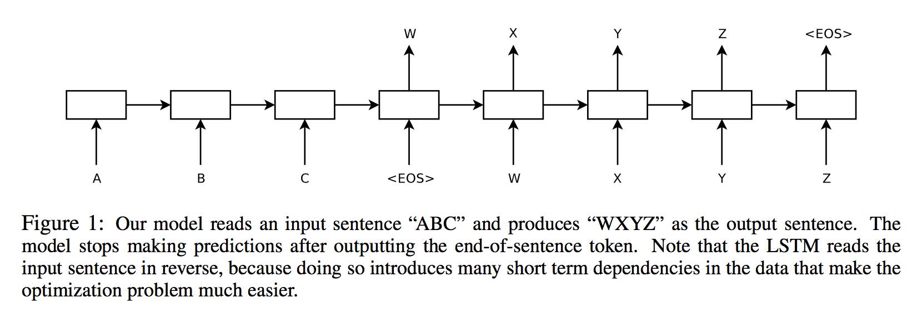

实际使用的模型有三个注意点：1. 编码器和解码器使用不同的LSTM，这不仅能够增强模型的能力，而且可以同时训练多个语言对。2. 深层LSTM效果比浅层LSTM好，论文中采用了4层LSTM。3. 作者发现将输入序列逆向后在输入模型十分重要。比如$a,b,c$不是对应于$\alpha, \beta, \gamma$，而是要求模型将$c,b,a$映射到$\alpha, \beta, \gamma$，其中$\alpha, \beta, \gamma$是$a, b, c$的翻译。这样的好处是，使得$a$和$\alpha$，$b$和$\beta$更加接近，使得更容易在输入序列和输出序列中建立联系。作者发现这个简单的操作能够大大提升效果。

## **[NEURAL MACHINE TRANSLATION BY JOINTLY LEARNING TO ALIGN AND TRANSLATE](https://arxiv.org/pdf/1409.0473.pdf)**

作者提出基本编码器-解码器的神经机器翻译架构将输入序列编码成一个固定长度的向量这一做法，是效果提升的瓶颈所在，因此提出让模型自己软搜索和下一个目标词相关的输入序列中的词，而不是硬性的进行词对齐。这其实就是attention注意力模型在机器翻译上的应用，并且作者展示了模型学到的软对齐符合人类常识。

模型整体采用了双向RNN作为编码器，解码器在解码时需要同时搜索输入序列进行软对齐。

首先介绍解码器的通用架构。定义条件概率如下：

$$
p(y_i|y_1,...,y_{i-1},\bold x)=g(y_{i-1}, s_i, c_i)
$$ (1)

其中$s_i$是$i$时刻RNN的隐层状态，计算如下：

$$
s_i=f(s_{i-1}, y_{i-1}, c_i)
$$ (2)

和传统目标序列条件概率不同，目标词$y_i$依赖一个称之为上下文向量的$c_i$。上下文向量$c_i$又依赖annotation序列$(h_1,...,h_{T_x})$，这个annotations序列序列由编码器映射输入序列得到，其中每个annotation$h_i$包含整个输入序列的信息，尤其关注输入序列中第$i$个词周围的信息，annotation的生成在下面介绍。上下文向量$c_i$由annotations的加权求和得到：

$$
c_i = \sum_{j=1}^{T_x}\alpha_{ij}h_j
$$ (3)

其中每个annotation的权重计算如下：

$$
\alpha_{ij}=\frac{\exp(e_{ij})}{\sum_{k=1}^{T_x}\exp(e_{ik})}
$$ (4)

其中

$$
e_{ij} = a(s_{i-1}, h_j)
$$ (5)

$e_{ij}$称为对齐模型，评价输出序列中第$i$个词和输入序列中第$j$个词有多匹配。通常对齐模型$a$使用一个前馈神经网络，和模型的其他部分一起参与训练。

$\alpha_{ij}$或者$e_{ij}$表示了annotation$h_i$对于前一个隐层状态$s_{i-1}$决定当前隐层状态$s_i$和输出$y_i$的重要性。直观地，这实现了一个带有注意力的解码器，解码器能够决定需要注意什么。通过注意力机制，编码器不需要将输入序列的所有信息包含到一个长度固定的向量中，输入序列的信息分散到annotation序列中，解码器可以自己选择要使用哪些信息去解码。

下面介绍编码器的通用架构。传统编码器只能够按顺序进行编码，而annotation不仅需要包含之前的信息，也需要包含之后的信息，因此使用双向RNN来做编码。双向RNN中前向RNN按照正常顺序读入输入序列，得到前向隐层状态$(\overrightarrow{h_1},...,\overrightarrow{h_{T_x}})$，后向RNN按照逆序读入输入序列，得到后向隐层状态$(\overleftarrow{h_1},...,\overleftarrow{h_{T_x}})$，最后将前向隐层状态和后向隐层状态连接起来得到词的annotation，$h_j=[\overrightarrow{h_j}^T;\overleftarrow{h_j}^T]^T$，这样annotation $h_j$同时包含当前词之前和之后的信息，并且由于RNN更倾向于表示最近的信息，annotation $h_j$也会更加关注周围词的信息。

整体架构如下图所示：

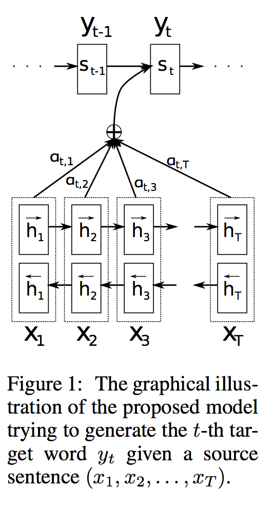

## **[Effective Approaches to Attention-based Neural Machine Translation](https://arxiv.org/pdf/1508.04025.pdf)**

由于还没有基于注意力的神经机器翻译模型，作者提出两个简单有效的注意力机制：全局注意力，总是考虑输入序列中的所有词；局部注意力，只考虑输入序列中的一部分词。分别如下两图所示：

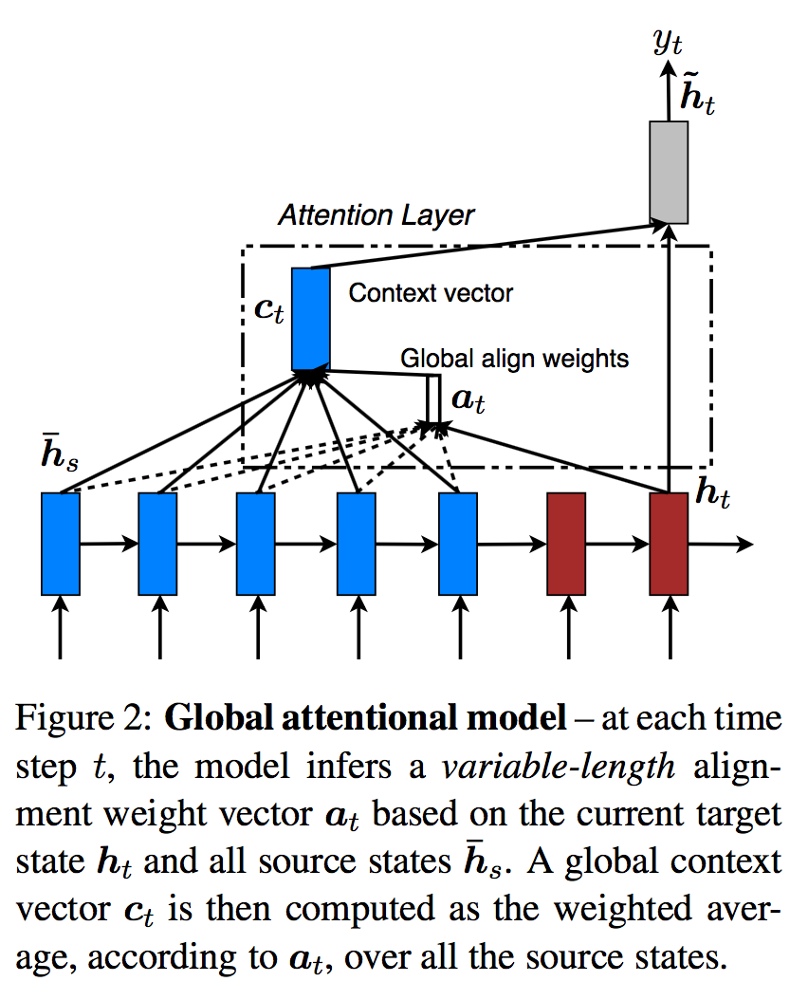

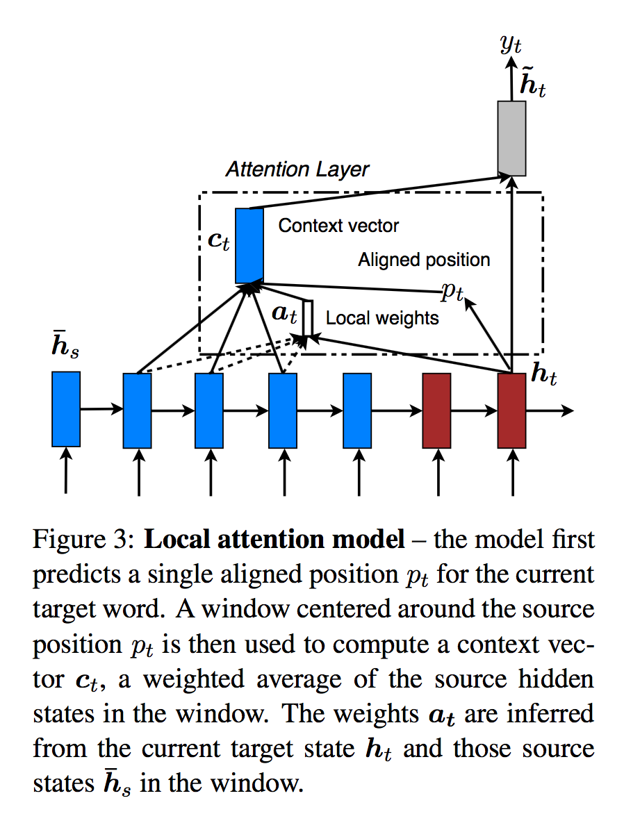

这两种模型的共同之处如下，首先都是把解码器stacking LSTM的顶层隐层状态$\bold{h_t}$作为输入，目标是推出上下文向量$\bold{c_t}$，能够捕捉相关源端的信息，用来预测当前的目标词$y_t$。上下文向量$\bold{c_t}$的推导两种方法不一样，之后再介绍。在得到$\bold{c_t}$后，将其和$\bold{h_t}$连接起来得到带有注意力的隐层状态$\tilde{\bold{h_t}}$：

$$
\tilde{\bold{h_t}}=\tanh(\bold{W_c}[\bold{c_t};\bold{h_t}])
$$ (1)

然后$\tilde{\bold{h_t}}$被输入softmax层来预测下一个目标词：

$$
p(y_t|y_{\lt{t}},x)=softmax(\bold{W_s}\tilde{\bold{h_t}})
$$ (2)

下面介绍全局注意力模型。一个和输入序列一样长的对齐向量$\bold{a_t}$用来比较当前目标隐层状态$\bold{h_t}$和所有源隐层状态$\bar{\bold{h_s}}$：

$$
\bold{a_t}(s)=align(\bold{h_t},\bar{\bold{h_s}})=\frac{\exp(score(\bold{h_t},\bar{\bold{h_s}}))}{\sum_{s'}\exp(score(\bold{h_t},\bar{\bold{h_{s'}}}))}
$$ (3)

这里的$score$被称为基于内容的函数，作者提出三种函数：

$$
score(\bold{h_t},\bar{\bold{h_s}})=\begin{cases}
\bold{h_t}^T\bar{\bold{h_s}}, & dot \\
\bold{h_t}^T\bold{W_a}\bar{\bold{h_s}}, & general \\
\bold{v_a}^T\tanh(\bold{W_a}[\bold{h_t};\bar{\bold{h_s}}]), & concat
\end{cases}
$$ (4)

除此之外，作者还提出一种基于位置的函数，只使用目标隐层状态来计算$\bold{a_t}$：

$$
\bold{a_t}=softmax(\bold{W_a}\bold{h_t})
$$ (5)

这种方法所有对齐向量$\bold{a_t}$一样长，对于短的输入句子，只使用$\bold{a_t}$前面的部分，对于长的输入句子，忽视句子的末尾部分。

之后将对齐向量作为权重，上下文向量$\bold{c_t}$是所有源隐层向量的加权平均。

下面介绍局部注意力模型。全局注意力模型需要注意输入句子中的所有词，这使得计算代价太大，并且实际中无法翻译长句子，因此提出局部注意力模型，只关注输入序列的一部分词。对于时刻$t$的目标词，首先生成一个对齐位置$p_t$，之后上下文向量$\bold{c_t}$是一个窗口内源隐层状态的加权平均，这个窗口为$[p_t-D,p_t+D]$，$D$是根据经验选择的。不同于全局注意力模型，此时局部对齐向量$\bold{a_t}$是固定长度的($\in R^{2D+1}$)，下面介绍该模型的两个变种：

单调对齐。简单设置$p_t=t$,假设目标词和源词是近似单调对齐的，这时对齐向量$\bold{a_t}$如公式(3)定义。

预测对齐。通过模型预测对齐位置：

$$
p_t=S \cdot sigmoid(\bold{v_p}^T\tanh(\bold{W_p}\bold{h_t}))
$$ (6)

其中$\bold{W_p},\bold{v_p}$是模型参数，$S$是输入序列长度，$sigmoid$函数导致$p_t\in[0,S]$。为了突出在$p_t$周围对齐，以中心在$p_t$的高斯分布进行采样，此时的对齐向量定义如下：

$$
\bold{a_t}(s)=align(\bold{h_t},\bar{\bold{h_s}})\exp(-\frac{(s-p_t)^2}{2\sigma^2})
$$ (7)

使用公式(3)描述的$align$函数，并且标准差设为$\sigma=\frac{D}{2}$，其中$p_t$是一个实数，$s$是以$p_t$为中心的窗口内的整数。

上面提到的全局注意力和局部注意力都是独立计算的，也是次优的，标准的翻译模型里需要维护一个覆盖率来追踪哪些输入句子里的词已经被翻译过了，因此神经翻译模型里也应该考虑之前的对齐信息。作者因此又提出input-feeding方法，将注意力向量$\tilde{\bold{h_t}}$和下一时刻的输入连接起来一起作为输入，如下图所示：

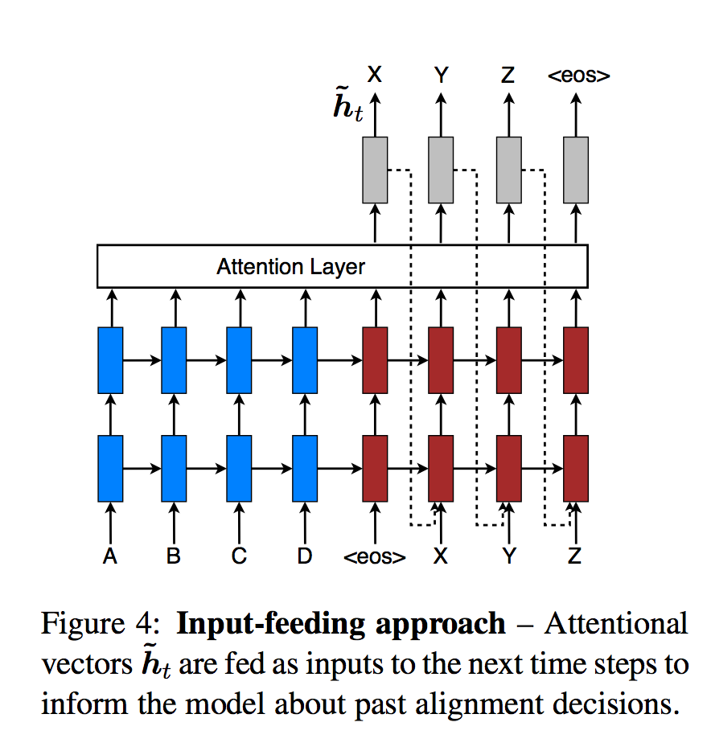

这样有两个好处：1. 可以考虑之前的对齐信息；2. 创造了一个水平垂直方向上更深的网络结构。

[代码和资料地址](https://nlp.stanford.edu/projects/nmt/)

## **[On Using Very Large Target Vocabulary for Neural Machine Translation](https://arxiv.org/pdf/1412.2007.pdf)**

神经机器翻译模型在处理大词表时，训练和解码复杂度都会急剧增加。作者提出基于importance sampling的方法，能够在不增加训练复杂度的情况下使用大词表，解码也可以仅使用大词表的一部分来提高效率。

计算下一个目标词softmax概率如下：

$$
p(y_t|y_{\lt t},x)=\frac{1}{Z}\exp(\bold{w_t}^T\phi (y_{t-1},z_t,c_t)+b_t)
$$ (1)

首先考虑公式(1)对数概率的梯度，包括正项和负项两部分：

$$
\nabla \log p(y_t|y_{\lt t},x)=\nabla \varepsilon(y_t)-\sum_{k:y_t\in V}p(y_k|y_{\lt t}, x)\nabla (y_k)
$$ (2)

其中能量$\varepsilon$定义为：

$$
\varepsilon (y_j)=\bold{w_j}^T\phi (y_{j-1},z_j,c_j)+b_j
$$ (3)

梯度的第二项（负项）就是能量的期望梯度：

$$
E_P[\nabla \varepsilon(y)]
$$ (4)

其中$P$表示$p(y|y_{\lt t}, x)$。

主要策略是通过importance sampling，用小部分采样去估计这个期望（梯度的负项）。给定一个分布$Q$和$Q$中的一组样本$V'$，预测公式(4)如下：

$$
E_P[\nabla \varepsilon(y)]\approx \sum_{k:y_k\in V'}\frac{w_k}{\sum_{k':y_{k'}\in V'}}\nabla \varepsilon(y_k)
$$ (5)

其中

$$
w_k=\exp(\varepsilon(y_k)-\log Q(y_k))
$$ (6)

这个方法能够在训练过程中只用大词表的一小部分去计算归一化项，从而大大降低参数更新的计算复杂度。

尽管这个方法大大降低计算复杂度，但是直接使用这个方法并不能保证每次更新的包含多个目标词的句子对所使用的参数数量是可控的，这在使用GPU这样的小内存设备时尤为麻烦。因此，实际中将训练语料分成若干份，每一份在训练前定义大词表的一个子集$V'$。在训练开始前，我们顺序的检查训练语料中的每一个目标句子，然后累计唯一目标词直到达到数量预定的阈值$\tau$。这个累计的词表就会用作这部分训练语料的词表，重复这个过程直到训练集结束。定义第$i$部分训练语料的词表为$V_i'$。

对于每一部分语料有一个预知的分布$Q_i$，$Q_i$对于$V_i'$中每一个词的概率相同，其他词的概率为0:

$$
Q_i(y_k)=\begin{cases}
\frac{1}{|V_i'|}, & if\ y_t\in V_i' \\
0, & otherwise
\end{cases}
$$ (7)

这个分布把公式(5)(6)中的修正项给去掉$-\log Q(y_k)$，使得提出的方法能够正确估计公式(1)的概率为：

$$
p(y_t|y_{\lt t},x)=\frac{\exp(\bold{w_t}^T\phi (y_{t-1},z_t,c_t)+b_t)}{\sum_{k:y_k\in V'}\exp(\bold{w_k}^T\phi(y_{t-1},z_t,c_t)+b_t)}
$$ (8)

值得注意的是使用的分布$Q$使得估计有偏差。

模型训练好后，可以用完整词表去解码，这样更加准确，但也更慢。因此解码时我们也可以只用词表的一小部分，但和训练时候的区别是，此时并不能直接吧把正确的目标词作为词表。最简单的做法是选取最常见的$K$个词，但是这样就不符合用大词表去训练模型的本意了。因此，可以使用现有的词对齐模型在训练语料上去对齐源词和目标词，然后建立字典。有了这个字典后，对于每一个输入句子，把最常见的$K$个词和字典中每个源词对应的$K'$个目标词构成目标词集合。$K$和$K'$的选择根据内存限制和效果要求，称构建出来的这个目标词集合为候选集。

[代码地址](https://github.com/sebastien-j/LV_groundhog)

## [Addressing the Rare Word Problem in Neural Machine Translation](https://arxiv.org/pdf/1410.8206.pdf)

神经机器翻译一个很大的缺点是不能够处理罕见词，一般只有一个很小的词表，并且用一个unk符号表示所有不在字典中的词。作者提出一个有效的方法解决这个问题，训练模型时同时输出词对齐结果，使得系统在目标句子中遇到OOV时能够定位源句子中与其对齐的词，这个信息在之后的后处理过程中用来根据字典翻译目标句子中的OOV。

作者提出在训练模型时能够追踪目标句子里的OOV在源句子中的位置，从而解决罕见词问题。如果知道了目标句子中OOV在源句子里对齐的词，可以在后处理时，把unk换成源句子中对应词的翻译或者这个词本身。

作者提出三种策略，能应用到任何机器翻译模型中。首先一个无监督的对齐器用来做对齐，然后利用这个对齐信息构建字典，用来在后处理过程中进行翻译。如果一个词没有出现在字典中，那么就把这个词直接拷贝到目标句子中。

首先介绍拷贝模型。这个方法使用多个unk符号来表示源语言和目标语言中的罕见词，而不是只用一个unk符号。把源句子中的OOV分别注释为unk1,unk2,unk3...相同的OOV被赋予相同的unk符号。目标句子中的OOV注释方法如下：目标语言中的OOV和源语言中的OOV对齐时，赋予源语言中OOV的unk符号（所以被称为拷贝模型），如果目标语言中OOV和源语言不对齐活着和不是OOV的词对齐，那么源语言中的OOV被赋予特殊的$unk_{\emptyset}$。如下图：

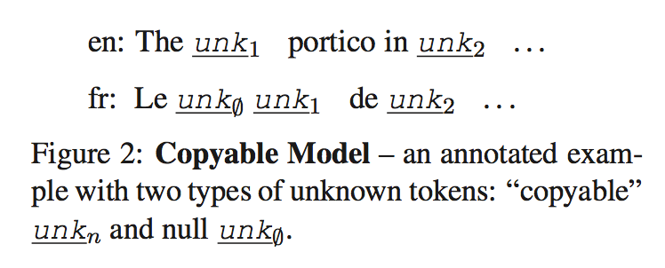

下面介绍PosAll模型。拷贝模型不能够处理目标语言中OOV和源语言中已知词对齐的情况，而这种情况会频繁出现在源语言词表大于目标语言词表时。这就需要能够建立源句子和目标句子间的完全对齐关系。

具体的，只使用一个unk符号，但是在目标语言端，需要在每一个词后面插入一个位置符号$p_d$，这里$d$表示相对位置关系$(d=-7,...,-1,0,1,...,7)$，表示目标语言中位置$j$处的词和源语言中位置$i=j-d$的词对齐，距离太远的对齐词被认为是不对齐的，这些词被注释为特殊null符号$p_n$。如下图：

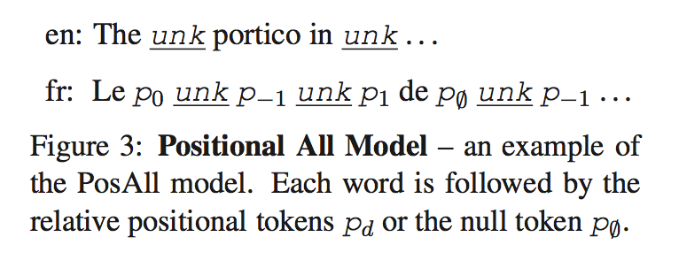

最后介绍PosUnk模型。PosAll模型的缺点在于它使得输入序列的长度加倍了，这使得学习更加困难，也更慢。由于我们的后处理只关心OOV词，所以可以只注释OOV词。PosUnk模型使用$unkpos_d(d=-7,...7)$来标注OOV词，并且$d$表示和对齐词的相对位置关系，同样使用$unkpos_{\emptyset}$表示不对齐的OOV，用unk注释源句子中的所有OOV。如下图：

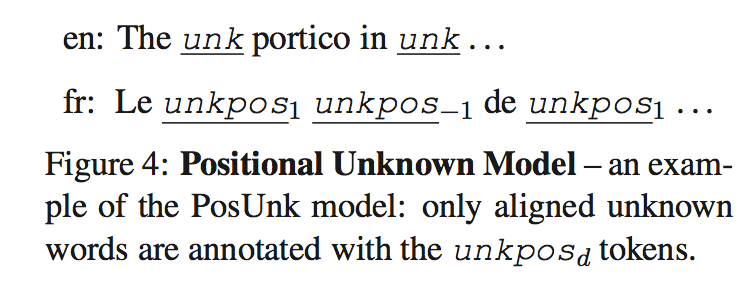

## **[Improving Neural Machine Translation Models with Monolingual Data](https://arxiv.org/pdf/1511.06709.pdf)**

神经机器翻译传统只使用双语语料，但是目标端的单语语料在传统统计翻译模型中能够提升翻译流畅度，作者探究如何在神经机器翻译中使用单语语料。之前的做法是将神经机器翻译模型和语言模型的结合起来，但是作者发现目前编码起啊解码器模型完全可以学到和语言模型一样的信息，并且不需要改变目前的模型架构。通过自动的后向翻译，可以将单语语料构建出一个合成的双语语料。

作者提出两种策略：1. 将目标单语语料和源语言的空句子组合成双语语料。2. 通过将目标单语语料翻译成源语言后，组成双语语料，这种方法作者称为后向翻译(back-translation)。

首先介绍用空句子构成双语语料。这种方法将目标语言的单语语料和源语言的空句子组合构成合成的双语语料，这样上下文向量$c_i$就不包含任何信息，模型完全通过前一个目标词预测当前目标词。这个方法和dropout的思想很像，也可以当作是一种多任务学习模型，当源句子知道时就是翻译任务，当源句子不知道时就是语言模型任务。

训练时把双语语料和单语语料1比1结合起来，并且随机打乱。当处理单语语料时把源句子设为单个\<null>词语，这样就可以用同一个模型同时训练单语语料和双语语料，当处理单语语料时，固定住编码器和注意力模型的参数。但存在一个问题，不能任意增加单语语料的比例，如果单语语料太大，网络将很难学习。

下面介绍后向翻译构成双语语料。用一个训练好的目标到源的机器翻译模型去翻译目标端的单语语料，然后得到的源语言句子和目标端单语语料一起构成合成的双语语料。这样在训练时将双语语料和合成双语语料混合起来，并且不作区分，参数也不需要固定。

## **[Modeling Coverage for Neural Machine Translation](https://arxiv.org/pdf/1601.04811.pdf)**

传统基于注意力的神经机器翻译会忽略之前的对齐信息，导致过度翻译或者欠翻译。为了解决这个问题，作者提出基于覆盖率的神经机器翻译，通过维护一个覆盖率向量来追踪对齐历史注意力信息。覆盖率向量被输进注意力模型，帮助调整将来的注意力，使得神经机器翻译模型多注意没有翻译到的词。

传统神经机器翻译模型不能够判断一个词是否被翻译，从而导致有些词被多次翻译，而有些词却没有被翻译。直接建模覆盖率比较困难，但是可以通过在解码过程中追踪注意力信息来缓解上述问题。最自然的方式就是给每个词的annotation（$h_j$）添加一个覆盖率向量，这个向量初始化为0向量，但是在每次注意力模型后进行更新。这个覆盖率向量被一起输入进注意力模型，帮着调整将来的注意力，使得模型能够更多关注没有被翻译的词。具体结构如下图所示：

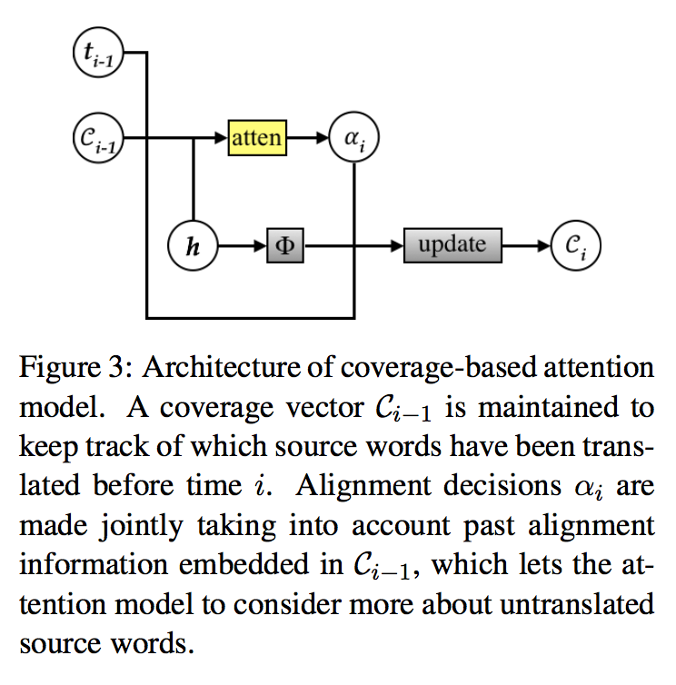

正式地，覆盖率模型定义如下：

$$
C_{i,j} = g_{update}(C_{i-1,j},\alpha_{i,j},\Phi(\bold{h_j}),\Psi)
$$ (1)

其中$g_{update}$是解码过程中时刻$i$新注意力$\alpha_{i,j}$产生后更新$C_{i,j}$的函数，$C_{i,j}$是$d$维覆盖率向量，包含了$\bold{h_j}$直到时刻$i$的所有注意力历史，$\Phi(\bold{h_j})$是词相关的特征，$\Psi$是不同覆盖率模型中的辅助输入。

公式(1)是一个通用覆盖率模型的架构，下面将介绍几种具体实现。

首先是基于语言学的覆盖率模型。神经机器翻译中，语言学上的覆盖率指某个词被翻译了百分之多少（软覆盖率），神经机器翻译中每一个目标词是由所有源词在$\alpha_{i,j}$的概率下翻译出来的，换句话说，每一个源词都参与到所有目标词的翻译中，并且时刻$i$参与到目标词$y_j$的概率为$\alpha_{i,j}$。

使用一个标量（$d=1$）来表示每一个源词语言学上的覆盖率，并且用累加操作作为$g_{update}$。初始的覆盖率为0，然后迭代的累加每次注意力模型生成的对齐概率，但是每一次的对齐概率都是由不同的上下文相关权重所归一化的。这样时刻$i$源词$x_j$的覆盖率计算如下：

$$
C_{i,j}=C_{i-1,j}+\frac{1}{\Phi_{j}}\alpha_{i,j}=\frac{1}{\Phi_j}\sum_{k=1}^i\alpha_{k,j}
$$ (2)

其中$\Phi_j$是预定义的权重，表示源词$x_j$预计生成多少个目标词。简单的做法是对于所有源词固定$\Phi=1$，但是实际翻译中每一个词对于最终的翻译结果贡献是不一样的，所以需要给每一个源词赋于不同的$\Phi_j$，理想结果是$\Phi_j=\sum_{i=1}^I\alpha_{i,j}$，其中$I$是解码的总时长。但是这个$\Phi_j$值在解码前是不得而知的。

为了预测$\Phi_j$，作者介绍了fertility的概念。源词$x_j$的fertility指他会生成多少个目标词，作者提出计算fertility $\Phi_j$如下：

$$
\Phi_j=G(x_j|\bold x)=N\cdot \sigma(U_f\bold{h_j})
$$ (3)

其中$N\in R$，是一个预定义的常数，表示一个源词能产生的目标词的最多个数，$\sigma(\cdot)$是一个逻辑斯蒂函数，$U_f\in R^{1\times 2n}$是权重矩阵。这里使用$\bold{h_j}$表示$(x_j|\bold x)$，因为$\bold{h_j}$包含了整个输入序列的信息，并且着重$x_j$周围的信息。因为$\Phi_j$不与$i$有关，所以可以在解码前进行预计算从而降低计算代价。

下面介绍基于神经网络的覆盖率模型。此时$C_{i,j}$是一个向量（$d\gt 1$），$g_{update}(\cdot)$是一个神经网络，实际使用RNN模型，如下图所示：

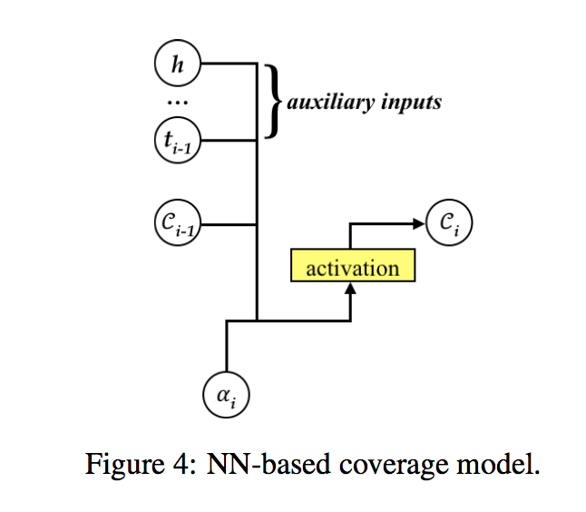

此时覆盖率计算如下：

$$
C_{i,j}=f(C_{i-1,j},\alpha_{i,j},\bold{h_j},\bold{t_{i-1}})
$$ (4)

其中$f(\cdot)$是一个非线性激活函数，$\bold{t_{i-1}}$是辅助输入，用来编码之前的翻译信息，即解码器的隐层状态。$f(\cdot)$可以是简单的非线性激活函数$\tanh$或者是门函数，作者发现使用门函数能够捕捉长距离的依赖，因此采用了GRU模型。

最后，在时刻$i$解码时，时刻$i-1$的覆盖率也会被一起输入进注意力模型，具体如下：

$$
e_{i,j}=a(\bold{t_{i-1}},\bold{h_j},C_{i-1,j})=v_a^T\tanh(W_a\bold{t_{i-1}}+U_a\bold{h_j}+V_aC_{i-1,j})
$$ (5)

其中$V_a\in R^{n\times d}$是注意力的权重矩阵，$n,d$分别是隐层维度和覆盖率维度。

[代码地址](https://github.com/tuzhaopeng/NMT-Coverage)

## **[Dual Learning for Machine Translation](https://arxiv.org/pdf/1611.00179.pdf)**

传统机器翻译需要大量双语语料进行训练，但是人工标注的成本又很高。为了解决训练数据的问题，作者提出一种对偶学习机制，使得神经机器翻译模型能够通过一个对偶学习的游戏自动从没有标注的语料中进行学习。一般机器翻译都可以分为源到目标和目标到源两个方向的翻译任务，主任务和对偶任务可以构成一个闭环，从而可以不借助人工标注的情况下产生有用的反馈信息从而训练翻译模型。在对偶学习机制中，使用一个agent表示主任务，另一个agent表示对偶任务，然后它们通过增强学习互相教对方学习。根据这一过程产生的反馈信息，可以迭代更新两个模型直到收敛作者称这种方法为dual-NMT。

考虑两个单语语料$D_A,D_B$，包含语言$A,B$的句子，但是这两个语料是不对齐的，甚至是不相关的。假设有两个比较弱的翻译模型，分别可以进行从$A$到$B$和从$B$到$A$的翻译，目标是只利用单语语料来提升两个模型的精度。假设$D_A$包含$N_A$个句子，$D_B$包含$N_B$个句子，$P(\cdot|s;\Theta_{AB})$和$P(\cdot|s;\Theta_{BA})$分别表示两个翻译模型，$\Theta_{AB},\Theta_{BA}$是模型参数。

假设有两个训练好的语言模型$LM_A(\cdot),LM_B(\cdot)$（可以通过单语语料训练得到），能够输入一个句子，输出一个数表示这个句子在这种语言中自然的概率。

对偶学习游戏开始时，有$D_A$中的句子$s$，然后中间翻译结果为$s_{mid}$，这个中间步骤产生一个reward $r_1=LM_B(s_{mid})$，表示这个中间翻译结果在语言$B$中多自然。然后用$s_{mid}$重建$s$的对数概率作为重建reward，即$r_2=\log P(s|s_{mid};\Theta_{BA})$。将两个reward线性加权，得到最终的reward $r=\alpha r_1+(1-\alpha)r_2$，其中$\alpha$是超参数。最后可以用策略梯度方法来最大化reward，从而训练模型。

通过对翻译模型$P(\cdot|s;\Theta_{AB})$进行采样得到$s_{mid}$，然后计算期望reward $E[r]$关于参数$\Theta_{AB},\Theta_{BA}$的梯度，根据策略梯度理论，结果如下：

$$
\nabla_{\Theta_{BA}}E[r]=E[(1-\alpha)\nabla_{\Theta_{BA}}\log P(s|s_{mid};\Theta_{BA})]
$$ (1)

$$
\nabla_{\Theta_{AB}}E[r]=E[r\nabla_{\Theta_{AB}}\log P(s_{mid}|s;\Theta_{AB})]
$$ (2)

基于公式(1)(2)，可以采用任意的采样方法去估计期望梯度，但是随机采样会带来大方差，甚至不可靠的结果，因此采用beam search来进行采样，作者通过贪婪算法产生概率最高的$K$个中间翻译结果，然后用均值表示梯度。

对偶学习游戏可以迭代多轮，算法细节如下图：

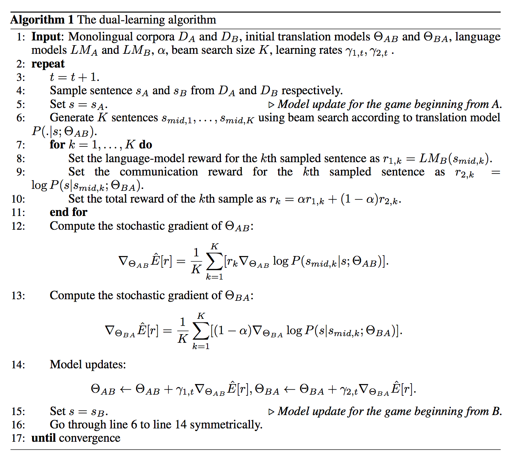

## **[Neural Machine Translation of Rare Words with Subword Units](https://arxiv.org/pdf/1508.07909.pdf)**

传统机器翻译是构建在一个固定字典上的，但是翻译本身是一个开放字典的人物，之前的工作通过准备一个字典来解决OOV问题。作者提出一个更加简单有效的方法，通过编码罕见词和未知词为子字串来使得机器翻译模型能够处理开放字典的翻译任务。作者讨论了不同的分词方案，包括简单的n-grams模型和基于byte pair encoding压缩算法的分词技术。

方法来源于人类在不认识一个词是可以通过子字来推测它的意思从而进行翻译，因此可以把罕见词分为子字串，使得神经网络能够学习这种翻译技术，从而更好的处理未知词。如果分词太细就会导致输入句子变得太长，所以权衡词表大小和输入大小，只对罕见词进行分词。

这里主要介绍基于byte pair encoding(BPE)的分词技术。BPE算法是一种简单的数据压缩技术，通过迭代地把序列中平凡出现的字节序列替换为没有出现过的单字节达到压缩的效果。作者改进这种方法，通过将字符不断合并达到提取子字的效果。

首先，建立字符表，然后将每一个词表示为字符序列，并且加上一个特殊的结束符号"$\cdot$"，这使得能够从子字序列重建词序列。然后迭代地计数字符对，把最频繁的字符对替换为新的字符，比如字符对('A','B')替换为'AB'，每次合并操作都会构成一个新的n-grams表，这样频繁的字符序列会最终被合并，构成最终的词表。最终词表的大小由初始词表大小加上合并操作次数，而这个合并操作次数可以调节，来调整词表大小和输入大小。构建词表过程中是不考虑跨词的字符序列的。这一过程的python实现如下图：

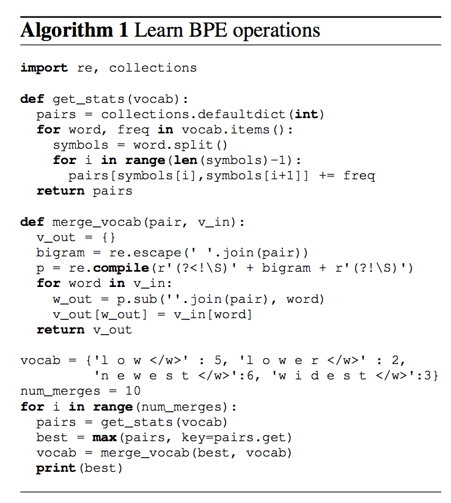

作者又分析了两种BPE方案，一种是分别构建源词表和目标词表，另一种是将源河目标结合共同构建一个词表。如果分别构建BPE词表，那么很可能同一个词会被不同地分割，从而使得神经网络很难学习子字之间的关系，所以为了增加词表的连贯性，可以使用联合构建BPE词表。（其他论文中大多采用联合构建BPE词表的方法）

[代码地址](https://github.com/rsennrich/subword-nmt)

## **[Linguistic Input Features Improve Neural Machine Translation](https://arxiv.org/pdf/1606.02892.pdf)**

传统机器翻译模型没有充分使用语言学特征，作者提出使用更多的语言学特征能够大大提升模型效果。作者拓展了编码器的embedding层，能够输入任意特征，除了传统的词特征，还添加了词法特征，词性特征和句法特征等。

传统编码器的隐层状态计算如下：

$$
\overrightarrow h_j=\tanh(\overrightarrow W Ex_j+\overrightarrow U \overrightarrow h_{j-1})
$$ (1)

其中$E\in R^{m\times K_x}$是词向量矩阵，$\overrightarrow W\in R^{n\times m},\overrightarrow U\in R^{n\times n}$是权重矩阵，$m,n$分别是词向量维度和隐层状态维度，$K_x$是源语言词表大小。作者拓展词向量层，是的能够输入任意数目$|F|$的特征：

$$
\overrightarrow h_j=\tanh(\overrightarrow W(||_{k=1}^{|F|}E_k x_{jk})+\overrightarrow U \overrightarrow h_{j-1})
$$ (2)

其中$||$表示向量连接，$E_k\in R^{m_k\times K_k}$是特征向量矩阵，$\sum_{k=1}^{|F|}m_k=m$，$K_k$是第$k$个特征的词表大小。

作者然后分别分析Lemma，子字tag(B-词的开始，I-词的中间，E-词的结尾，O-整个词)，词性特征（这个具体语言具体特征），词性和句法依存特征的作用，并且输入为BPE子字序列，每个子字赋予整个词的特征。例子如下图：

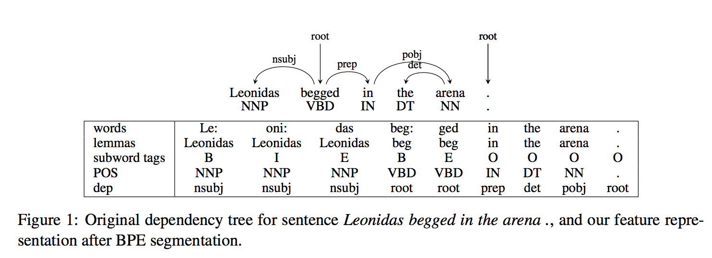

[代码地址](https://github.com/rsennrich/nematus)

## **[Incorporating Structural Alignment Biases into an Attentional Neural Translation Model](https://arxiv.org/pdf/1601.01085.pdf)**

机器翻译模型过于简化了，忽视了很多传统模型中关键的inductive biases。作者提出拓展现有机器翻译模型，从词对齐模型中引入structural biases，包括positional bias, Markov conditioning, fertility and agreement over translation directions。

作者认为现有机器翻译模型忽视了IBM模型中的传统对齐模型，Vogel的隐马尔可夫模型等关键部分，因此提出将这些部分作为structural biases结合进现在的机器翻译模型，可以大大提升效果。

首先考虑position bias，这个想法基于源句子中的词和目标句子中相对位置处的词趋向对齐（$\frac{i}{I}\approx\frac{j}{J}$）这一观察，IBM model 2中就包含了这种离散映射。作者通过改变注意力模型归一化前的$f_{ji}$计算公式来包含这一bias：

$$
f_{ji}=\bold v^T \tanh(\bold W^{(ae)}\bold e_i+\bold W^{ah}\bold g_{j-1}+\bold W^{(ap)}\psi(j,i,I))
$$ (1)

$$
\psi(j,i,I)=[\log(1+j),\log(1+i),\log(1+I)]^T
$$ (2)

其中$\bold W^{(ap)}\in R^{A\times 3}$。作者排除了$J$，因为在解码过程中$J$未知。使用$\log(1+\cdot)$函数是为了防止数值不稳定。

接着考虑Markov condition。Markov condition允许模型在知道$i$和$j$对齐后，拓展到$i+1$和$j+1$对齐或者$i$和$j+1$对齐等。Markov condition以类似position bias的方式加到模型中：

$$
f_{ji}=\bold v^T \tanh(...+\bold W^{(am)}\xi_1(\alpha_{j-1};i))
$$ (3)

其中...包含了之前的所有项。把所有注意力向量包含到$\alpha$中比较困难，因此作者简化只考虑周围$k$个位置，

$$
\xi_1(\alpha_{j-1};i) = [\alpha_{j-1,i-k},...,\alpha_{j-1,i},...,\alpha_{j-1,i+k}]^T
$$ (4)

其中$\bold W^{(am)}\in R^{A\times (2k+1)}$。

接着考虑fertility。首先考虑局部fertility，包含以下这个特征：

$$
\xi_2(\alpha_{\lt j};i)=[\sum_{j'\lt j}\alpha_{j',i-k},...,\sum_{j'\lt j}\alpha_{j',i},...,\sum_{j'\lt j}\alpha_{j',i+k}]
$$ (5)

对应的特征权重为$\bold W^{(af)}\in R^{A\times (2k+1)}$。这些求和项表示周围词的fertility。

接下来考虑全局fertility。提出以下计算fertility的模型：

$$
p(f_i|\bold s,i)=G(\mu(e_i),\sigma^2(e_i))
$$ (6)

其中$f_i=\sum_j\alpha_{j,i}$,$G()$为正态分布。

最后把$\sum_i \log p(f_i|\bold s,i)$这一项作为额外的additive项加到训练目标中。

最后考虑Bilingual Symmetry。作者提出同时训练两个翻译方向上的对齐，也就是要优化下面这一项：

$$
L=-\log p(\bold t|\bold s)-\log p(\bold s|\bold t)+\gamma B
$$ (7)

$B$用来连接两个方向上的模型，$B$应该考虑$\alpha^{s\rightarrow t}\in R^{I\times J},\alpha^{t\rightarrow s}\in R^{J\times I}$这两个对齐矩阵，并且使得它们尽可能接近。作者提出迹奖励来达到这个目的：

$$
B=-tr(\alpha^{s\rightarrow t}\alpha^{t\rightarrow s})=\sum_j\sum_i \alpha^{s\rightarrow t}_{i,j}\alpha^{t\rightarrow s}_{j,i}
$$ (8)

如下图所示：

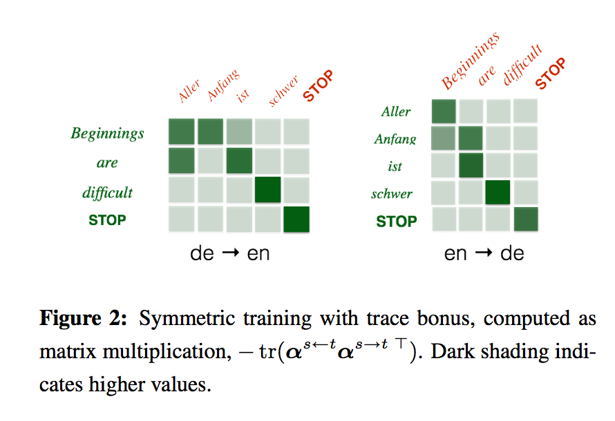

## **[Google’s Neural Machine Translation System: Bridging the Gap between Human and Machine Translation](https://arxiv.org/pdf/1609.08144.pdf)**

谷歌介绍自己翻译系统的论文，讨论了很多工程细节。

神经机器翻译系统在训练和推断时都很慢，在大模型大数据下甚至会无法实现，也有学者表示当句子中有罕见词时模型结果不鲁棒，这些都导致现有的神经机器翻译模型无法应用到实际服务中。本文提出了GNMT，谷歌神经机器翻译系统，尝试解决上述问题。这个模型用了很深的LSTM网络，并且编码器和解码器都有8层，并且使用了残差连接和注意力连接。为了提高并行性从而降低训练时间，注意力机制直接把解码器的底层和编码器的顶层连接起来。为了加速最终的翻译速度，在推断时采用低精度运算。为了处理罕见词，将输入和输出分割为有限的子字集，并且很好的平衡了字模型的灵活性和词模型的高效性，从而很好的处理了罕见词，并且最终提升了模型效果。模型采用的束搜索采用了长度归一化和覆盖率惩罚，使得生成的句子覆盖所有源词。为了直接优化BLEU分数，通过增强学习来改进模型，但是发现BLEU分数的提升并不意味着翻译结果的改善。模型整体架构如下图：

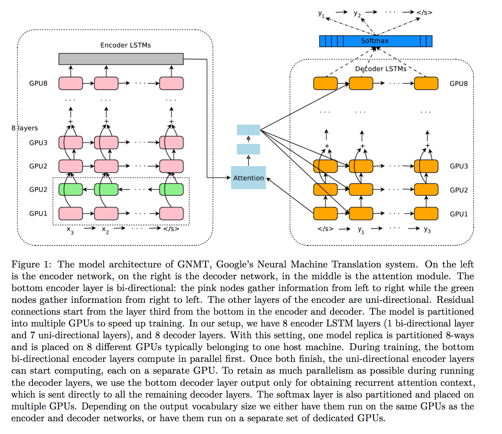

令$(X,Y)$是源和目标句子对，$X=x_1,...,x_M,Y=y_1,...,y_N$。

首先考虑残差连接。更深的LSTM会带来更好的结果，但是当深到一定程度时会导致模型学习很慢，并且很难学习，可能是因为梯度爆炸和梯度消失等问题。作者发现4层LSTM效果还好，6层就开始效果一般，8层时效果就变差了。根据残差连接在其他模型中的成功，也把残差连接这一结构应用到深层LSTM结构中。具体地说，$LSTM_i,LSTM_{i+1}$分别表示第$i$层和第$i+1$层LSTM，参数分别为$\bold W^i$和$\bold W^{i+1}$，在时刻$i$时，带有残差连接的LSTM结构如下：

$$
\begin{aligned}
\bold c_t^i,\bold m_t^i &= LSTM_i(\bold c_{t-1}^i,\bold m_{t-1}^i,\bold x_t^{i-1};\bold W^i) \\
\bold x_t^i &= \bold m_t^i+\bold x_t^{i-1} \\
\bold c_t^{i+1},\bold m_t^{i+1} &= LSTM_{i+1}(\bold c_{t-1}^{i+1},\bold m_{t-1}^{i+1},\bold x_t^i;\bold W^{i+1})
\end{aligned}
$$ (1)

残差连接能够极大改善反向传播时梯度的流动，从而从能训练特别深的网络。

接着考虑编码器第一层使用双向模型。采用双向RNN来包含之前词和之后词的信息，但为了增加并行性，只在编码器的底层使用双向RNN。

接着考虑模型并行性。同时利用模型并行和数据并行来加速训练。数据并行很直观：用Downpour随机梯度下降算法同时训练n个相同的模型。这n个模型共享一套参数，每个模型异步地更新参数。除此之外，模型并行用来加速每个模型上的梯度计算，编码器和解码器网络在深度方向上分割，并且被放到不同的GPU上运行，一般一个GPU跑一层网络。除了编码器第一层外，其他都是单向的，所以第$i+1$层可以在第$i$层完全结束前开始计算，从而提高了训练速度。softmax层也被分割处理，每一块只负责整个词表的一部分的计算。由于模型并行性要求，所以只在编码器底层使用双向RNN。在模型的注意力模块，选择把编码器的顶层和解码器的底层进行对齐，也是为了模型并行性的考虑，如果把解码器的顶层和编码器的顶层进行对齐操作，那么整个解码器将无法使用多个GPU来实现并行。

接着考虑分词方法。采用子字来解决OOV问题。采用最初用于日韩文分词问题的wordpiece模型来实现分词到子字序列。为了处理任何词，使用训练好的wordpiece模型将词分割为wordpiece，特殊的词边界符号加到句子中，使得能够从wordpiece序列恢复成词序列。下面是一个例子：

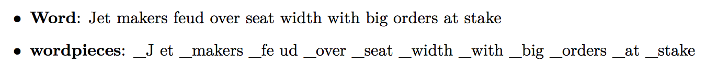

wordpiece模型使用数据驱动的方法，在给定逐步发展的词顶一下，最大化训练语料的类似语言模型的似然。给定训练语料和需要产生的tokens数目$D$，优化目标是选取$D$个wordpiece使得根据选定wordpiece模型分割的wordpieces树木最小。最贪婪的算法类似于《Neural machine translation of rare words with subword units》中的算法，更多算法细节参考《Japanese and Korean voice search》。和原始实现不同的是，只在词开始处添加特殊边界符号，并且根据语料将基础字符限制到一个可调的数目，并且把剩下的词全部映射到未知字符，避免十分罕见的字符干扰wordpieces词表。作者发现8k和32k wordpieces词表在所有试过的语言对中能够同时保持好的BLEU分数和快速解码速度。对于有些罕见的实体词和数字，直接拷贝是个很好的策略，因此对于源语言和目标语言使用一个共享的wordpieces，使得两种语言对于同一个词有相同的分隔方式，从而使得系统能够学习直接拷贝极罕见词。

第二种处理OOV的方法是使用混合字／词模型。保持一个固定大小的词表，，并且把OOV表示成字序列，并且特殊的前缀加到字符前面，这个词缀不仅用来表示字符在词中的位置，并且用来和词表中的字符区分开来，总共有三种前缀，\<B>,\<M>,\<E>分别表示词头，词中间和词尾。这个处理在源句子和目标句子中都要进行。解码时输出的罕见词就是字符序列，并且可以通过前缀恢复出词序列。

下面考虑训练标准。传统机器翻译模型优化目标如下：

$$
O_{ML}(\bold \theta) = \sum_{i=1}^N \log P_{\theta}(Y^i|X^i)
$$ (2)

尝试在训练好的机器翻译模型上再直接把BLEU分数作为reward进行训练，优化目标是期望reward：

$$
O_{RL}(\bold \theta)=\sum_{i=1}^N\sum_{Y^{pred}\in \mathscr Y}P_\theta (Y^{pred}|X^i)r(Y^{pred},Y^i)
$$ (3)

其中$r(Y^{pred}, Y^i)$表示推断翻译的得分，计算某个长度下的所有预测翻译的期望。

BLEU在用于单个句子时有些缺点，因为BLEU本身是设计评价语料的，所以提出变种GLEU作为增强学习的reward。GLEU中，记录句子的所有1-gram，2-grams，3-grams，4-grams序列，然后计算召回率，即在ground truth中出现的所有共现子序列的比例，再计算准确率，即生成翻译中出现的所有共现子序列比例，最后GLEU分数就是召回率和准确率中的较小值。GLEU分数在0到1之间，并且交换ground truth和翻译句子，结果是对称的。作者称实验结果GLEU和BLEU成正关系，并且没有BLEU在单个句子上的缺点。

按照通常增强学习的做法，需要把公式(3)中的$r(Y^{pred},Y^u)$减去reward的均值，这个均值可以从分布$P_\theta(Y^{pred}|X^i)$独立地采样$m$个句子来计算reward均值，作者把$m$设为15。为了使得训练更加稳定，采用公式(2)(3)的线性组合作为训练目标：

$$
O_{mixed}(\bold \theta)=\alpha\times O_{ML}(\bold \theta)+O_{RL}(\bold \theta)
$$ (4)

作者设$\alpha$为0.017。

实际训练中，首先用公式(2)作为训练目标直到收敛，然后用公式(4)作为训练目标直到验证集上BLEU分数不再提高。第二步的训练是可选的。

下面考虑模型和推断过程的量化处理。对于实现交互级翻译产品，推断过程太慢是个严重的问题。作者提出一种量化推断方法，使用低精度计算技术能够大幅度节省计算，但是这个方法只局限于谷歌才有的硬件设备上。为了降低量化处理所带来的误差，训练时模型需要有额外的限制，从而使得量化处理对结果的影响最小。

回忆公式(1)中的两个累加变量：$\bold c_t^i$在时间方向上累加，$\bold x_t^i$在模型深度上累加，理论上这两个累加变量的范围是无限的，但是实际中发现它们的值都很小，因此为了量化推断，把他们的值限制在$[-\delta,\delta]$范围内，从而保证后续量化处理是在一个固定范围内进行的。公式(1)改为如下：

$$
\begin{aligned}
{\bold c'}_t^i,{\bold m}_t^i&=LSTM_i({\bold c}_{t-1}^i,{\bold m}_{t-1}^i,{\bold x}_t^{i-1};{\bold W}^i) \\
{\bold c}_t^i&=\max(-\delta,\min(\delta,{\bold c'}_t^i)) \\
{\bold x'}_t^i&={\bold m}_t^i+{\bold x}_t^{i-1} \\
{\bold x}_t^i&=\max(-\delta,\min(\delta,{\bold x'}_t^i)) \\
{\bold c'}_t^{i+1},{\bold m}_t^{i+1}&=LSTM_{i+1}({\bold c}_{t-1}^{i+1},{\bold m}_{t-1}^{i+1},{\bold x}_t^i;{\bold W}^{i+1}) \\
{\bold c}_t^{i+1}&=\max(-\delta,\min(\delta,{\bold c'}_t^{i+1}))
\end{aligned}
$$ (5)

展开公式(5)中的$LSTM_i$来包含内部的门逻辑，为了简化，不写上标$i$：

$$
\begin{aligned}
\bold W &= [\bold W_1, \bold W_2, \bold W_3, \bold W_4, \bold W_5, \bold W_6, \bold W_7, \bold W_8] \\
\bold i_t&=sigmoid(\bold W_1 \bold x_t+\bold W_2 \bold m_t) \\
\bold {i'}_t&=\tanh(\bold W_3 \bold x_t + \bold W_4 \bold m_t) \\
\bold f_t &=sigmoid(\bold W_5 \bold x_t + \bold W_6 \bold m_t) \\
\bold o_t &=sigmoid(\bold W_7 \bold x_t + \bold W_8 \bold m_t) \\
\bold c_t &= \bold c_{t-1}\odot\bold f_t+\bold {i'}_t\odot\bold i_t \\
\bold m_t &= \bold c_t \odot \bold o_t
\end{aligned}
$$ (6)

当进行量化推断时，把公式(5)(6)中的所有浮点操作换为8-bit或者16-bit精度的定点整数操作。公式里的权重矩阵$\bold W$用8-bit整数矩阵$\bold {WQ}$和浮点向量$\bold s$表示如下：

$$
\begin{aligned}
\bold s_i &= \max(abs(\bold W[i,:])) \\
\bold{WQ}[i,j] &= round(\bold W[i,j]/\bold s_i \times 127.0)
\end{aligned}
$$ (7)

所有的累加变量（$\bold c_t^i, \bold x_t^i$）表示为$[-\delta,\delta]$范围内的16-bit整数，所有的矩阵乘法使用8-bit整数乘法累加代替，其他所有操作，包括激活函数和逐元素操作都使用16-bit整数操作代替。

接下来关注softmax层。在训练中，给定解码器的输出$\bold y_t$，计算所有候选输出符号上的概率$\bold p_t$如下：

$$
\begin{aligned}
\bold v_t &= \bold W_s * \bold y_t \\
\bold v'_t &= \max(-\gamma,\min(\gamma, \bold v_t)) \\
\bold p_t &= softmax(\bold v'_t)
\end{aligned}
$$ (8)

其中截断区间$\gamma$设为25。在量化推断时，权重矩阵$\bold W_s$替换为8-bit，矩阵乘法使用8-bit操作，softmax和注意力模型在推断时不做量化处理。

值得重视的是，训练时是采用完整精度的浮点数的。训练时加到模型上的限制只有将累加变量截断到$[-\delta,\delta]$和将softmax logits截断到$[-\gamma,\gamma]$。$\gamma$固定为25，$\delta$从训练开始时的$\delta=8.0$逐渐变化为训练结束时的$\delta=1.0$，在推断时$\delta=1.0$。这些额外的限制没有影响模型的收敛，也没有影响模型最终的效果，甚至加约束的模型效果会更好一点，这可能是这些约束也起到了正则项的作用。

以上这些量化处理只能在谷歌的TPU上进行。

最后考虑解码器。使用束搜索进行推断，介绍两种改进方法：覆盖率惩罚和长度归一化。对于长度归一化，因为需要考虑不同长度的翻译出来的句子，如果不采取长度归一化，由于训练目标是负对数似然，所以长的句子一般得分都会比较低。最简单的长度归一化是把最终结果除以长度，然后可以使用启发式来改进，除以${length}^\alpha$，其中$0\lt \alpha \lt 1$，$\alpha$可以根据验证集进行优化（作者发现$\alpha \in [0.6-0.7]$是比较好的），最后采用了下面这个更好的得分函数，包括了覆盖率惩罚，使得翻译能够覆盖到整个源句子。使用如下的得分函数$s(Y,X)$来给候选翻译句子进行排序：

$$
\begin{aligned}
s(Y,X)&=\log(P(Y|X))/lp(Y) + cp(X;Y) \\
lp(Y)&=\frac{(5+|Y|)^\alpha}{(5+1)^\alpha} \\
cp(X;Y)&=\beta * \sum_{i=1}^{|X|}\log(\min(\sum_{j=1}^{|Y|}p_{i,j},1.0))
\end{aligned}
$$ (9)

其中$p_{i,j}$是第$j$个目标词注意第$i$个源词的概率，$\sum_{i=0}^{|X|}p_{i,j}=1$，参数$\alpha,\beta$分别控制长度归一化和覆盖惩罚的比例。

在束搜索时，一般取8-12个翻译句子，但是发现只取2-4个翻译句子，只对BLEU得分有很小的影响。除此之外还采取两种剪枝策略，首先选取每个目标词时只考虑词概率最大的beamsize个，其次用公式(9)得到最终得分后，把所有可能翻译里最终得分小于最好得分的剪枝掉。采用上面两种剪枝后，可以提速30%-40%。作者设beamsize=3。

为了加速decode速度，把句子长度类似的句子放在同一个batch中，使得更好利用并行性。束搜索只有当batch中所有句子的所有翻译可能都在束外才结束，虽然理论上这样会很低效，但实际只增加了很小的计算代价。

作者还发现，当把长度归一化，覆盖率惩罚和增强学习一起使用时，长度归一化和覆盖惩罚起的作用很变小，这可能是增强学习已经考虑了上面两个因素。通过实验比较最后采用参数$\alpha=0.2,\beta=0.2$。

## **[Attention Is All You Need](https://arxiv.org/pdf/1706.03762.pdf)**

提出一种新型机器翻译模型架构，称为Transformer，完全建立在注意力机制上，不用RNN或者CNN。实验表明这种架构不仅效果更好，并行性也更好，能够极大地缩短训练时间。

Transformer使用堆叠自注意力，并且编码器和解码器使用逐点全连接层，如下图所示：

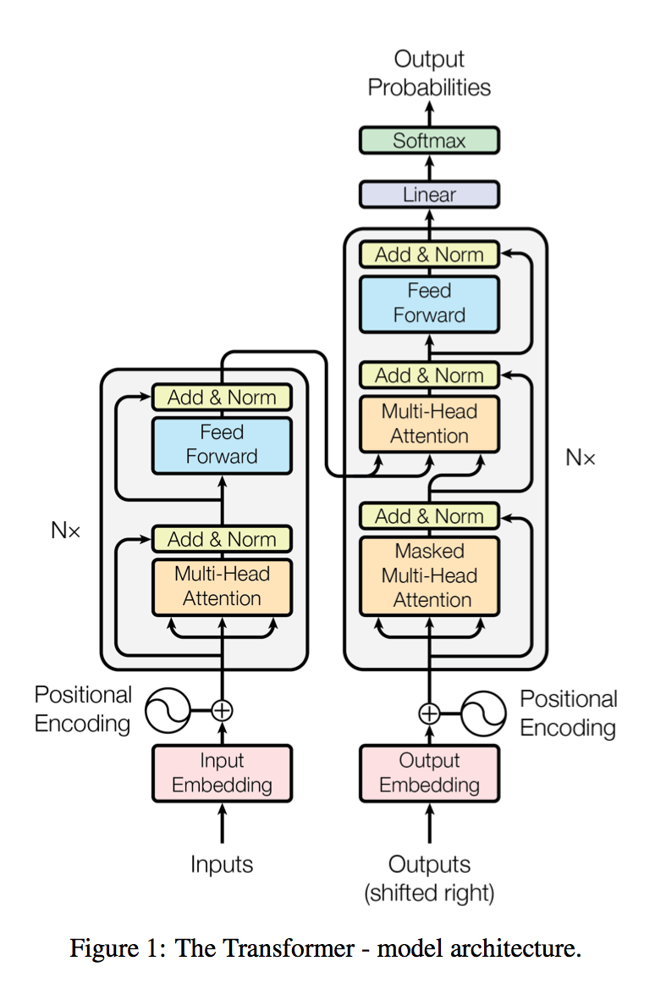

编码器由6层相同网络堆叠而成，每一层包含两个子层，第一个是多头自注意力机制，第二个是简单的，逐位置全连接前馈网络。并且在两个子层都使用残差连接和层归一化。为了更好地利用残差连接，所有子层和词向量层的维度都设为$d_{model}=512$。

解码器同样由6层相同网络堆叠而成，除了编码器中的两个子层外，添加了第三个子层，对编码器输出进行多头注意力机制。和编码器一样采用残差连接和层归一化，并且修改了自注意力机制，使得当前词的预测不受将来词的影响。

注意力机制可以概括为，将一个query和一组键值对映射到输出上，其中query，键，值和输出都是向量。输出是值的加权和，这个权值由query和健计算得到。作者提出了“伸缩点乘注意力”，如下图所示：

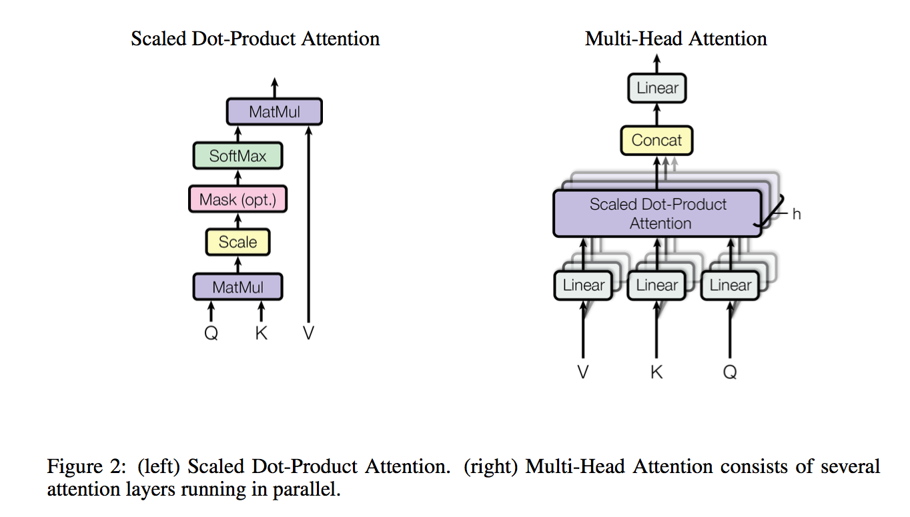

输入包括$d_k$维的quey和键，$d_v$维的值。计算query和所有键的点乘，然后除以$\sqrt{d_k}$，然后利用softmax得到值的权重。实际操作时，把query,键和值都堆叠成矩阵$Q,K,V$，然后输出计算如下：

$$
Attention(Q,K,V)=softmax(\frac{QK^T}{\sqrt{d_k}})V
$$ (1)

除以$\sqrt{d_k}$是为了防止进入softmax的值太大而导致梯度太小。

作者发现做多次注意力操作能够大大提升性能，计算公式如下：

$$
\begin{aligned}
MultiHead(Q,K,V)&=Concat(head_1,...,head_h)W^O \\
where\ head_i=Attention(QW_i^Q,KW_i^K,VW_i^V)
\end{aligned}
$$ (2)

其中$W^O\in R^{hd_v\times d_{model}},W^Q\in R^{d_{model \times d_k}},W^K\in R^{d_{model \times d_k}},W^V\in R^{d_{model \times d_v}}$是projection矩阵。采用$h=8$层并行注意力层，$d_k=d_v=d_{model}/h=64$，由于每一层维度的减少，最后计算代价和单层完整维度的注意力一样。

Transformer中多头注意力用到下面三个地方：1. 编码器和解码器间的注意力，query来自前一个解码层，键和值来自编码器的输出，这使得解码器的每一个位置都可以注意输入序列的所有位置；2. 编码器有一个自注意力层。自注意力层里，query，键和值都来自同一个地方，也就是前一层编码器的输出，编码器可以注意到前一层编码器输出的所有位置；3. 同样解码器也有一个自注意力层，来注意直到当前位置的所有位置。为了保持自回归特性，在伸缩点积注意力中用$-\infty$去除softmax中不合理的输入。

除了注意力子层外，编码器和解码器中每一层都包含一个全连接前馈网络，用来独立地作用到每一个位置上，具体如下：

$$
FFN(x)=\max(0,xW_1+b_1)W_2+b_2
$$ (3)

每一层的参数都不一样，输入和输出都是$d_{model}=512$，中间结果的维度为$d_{ff}=2048$。

使用训练好的词向量将输入和输出转化为$d_{model}$维的向量，使用softmax得到下一个词的概率，输入和输出词向量层以及softmax前的线性变换层使用同一套参数矩阵，并且词向量层中，把权重乘以$\sqrt{d_{model}}$。

由于提出的这个模型中没有使用RNN或者CNN，所以为了让模型使用序列顺序的信息，给序列中每个token添加了相对和绝对位置的信息，也就是添加了位置编码进编码器和解码器最底层的词向量中。位置编码也是$d_{model}$维的，这样可以和词向量相加，有多重位置编码的实现方法，作者使用了不同频率的sin和cos函数：

$$
\begin{aligned}
PE_{(pos,2i)}&=\sin(pos/1000^{2i/d_{model}}) \\
PE_{(pos,2i+1)}&=\cos(pos/1000^{2i/d_{model}})
\end{aligned}
$$ (4)

其中$pos$是位置，$i$是维度。这样位置编码的每一个维度都对应一个正弦波，波长构成从$2\pi$到$1000\cdot 2\pi$的等比级数。选择这个函数是因为，它允许模型学习到相对位置上的注意力，因为对于固定的偏移$k$，$PE_{pos+k}$能够表示为$PE_{pos}$的线性组合。

[代码地址](https://github.com/tensorflow/tensor2tensor)

## **[Deliberation Networks: Sequence Generation Beyond One-Pass Decoding](https://papers.nips.cc/paper/6775-deliberation-networks-sequence-generation-beyond-one-pass-decoding.pdf)**

传统的机器翻译模型解码器只进行一遍，这样就缺少了类似人类的推敲过程。作者提出将推敲结合近编码器解码器模型中，称为推敲网络，用来生成序列。推敲网络包含两遍解码过程，第一遍解码生成一个比较粗糙的序列，第二遍解码通过推敲打磨改善生成的序列。由于第二遍解码时有了关于生成序列的全局信息，可以通过查看将来的词来生成更好的序列。

推敲网络包含编码器，第一遍解码器$D_1$和第二遍解码器$D_2$。推敲发生在第二遍解码过程，因此也称为推敲解码器。整体架构如下图所示：

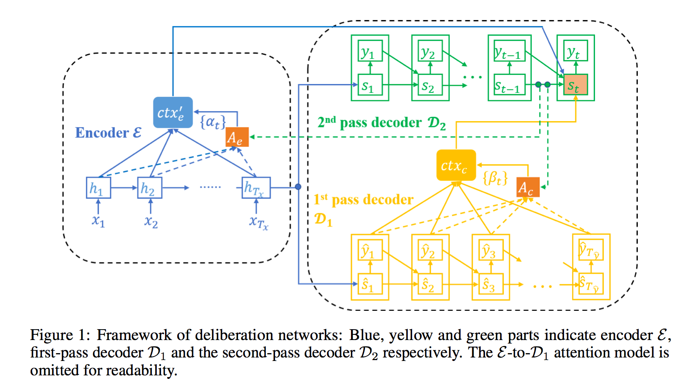

下面为了叙述简洁，省略所有bias项。

当输入序列$x$被输进编码器后，被编码为$T_x$个隐层状态$H={h_1,...,h_{T_x}}$，其中$T_x$是$x$的长度。具体地，$h_i=RNN(x_i,h_{i-1})$，其中$x_i$是$x$中第$i$个词，$h_0$是零向量。第一遍解码会生成一系列隐层状态$\hat{s_j},\forall j\in [T_{\hat y}]$和第一遍解码后的序列$\hat{y_j},\forall j\in [T_{\hat y}]$，其中$T_{\hat y}$是生成序列的长度。在第$j$步，$D_1$中的注意力模型首先计算上下文向量$ctx_e$如下：

$$
\begin{aligned}
ctx_e &= \sum_{i=1}^{T_x}\alpha_i h_i \\
\alpha_i &\propto \exp(v_\alpha^T\tanh(W_{att,h}^ch_i+W_{att,\hat s}^c\hat{s_{j-1}}))\ \forall i\in [T_x] \\
\sum_{i=1}^{T_x}\alpha_i &= 1
\end{aligned}
$$ (1)

有了$ctx_e$，$\hat s_j=RNN([\hat y_{J-1};ctx_e],\hat s_{j-1})$，得到$\hat s_j$后，另一个仿射变换应用到连接后的向量$[\hat s_j;ctx_e;\hat y_{j-1}]$上，最后将结果传给softmax层，$\hat y_j$在分布中采样得到。

第一遍解码得到的$\hat y$被输入进第二遍解码做推敲。在时刻$t$，$D_2$把前一时刻隐层状态$s_{t-1}$，前一时刻输出$y_{t-1}$，源句子的上下文信息$ctx'_e$和第一遍解码的上下文信息$ctx_c$作为输入。两个细节：1. $ctx'_e$的计算和公式(1)类似，但有两个不同，首先是$\hat s_{j-1}$被替换为$s_{t-1}$，其次模型的参数不同；2. 为了得到$ctx_c$，$D_2$有一个注意力模型（上图中的$A_c$），能够将词$\hat y_j$和隐层状态$\hat s_j$映射到上下文向量中，具体计算如下：

$$
\begin{aligned}
ctx_c &= \sum_{j=1}^{T_{\hat y}}\beta_j[\hat s_j;\hat y_j] \\
\beta_j &\propto \exp(v_\beta^T\tanh(W_{att,\hat{sy}}^d[\hat s_j;\hat y_j]+W_{att,s}^ds_{t-1}))\ \forall j\in [T_{\hat y}] \\
\sum_{j=1}^{T_{\hat y}}\beta_j &= 1
\end{aligned}
$$ (2)

可以看到时刻$t$的推敲过程将用到第一遍解码得到的整个序列的信息。得到$ctx_c$后，计算$s_t=RNN([y_{t-1};ctx'_e;ctx_c],s_{t-1})$，类似于$D_1$中的$\hat y_t$，$[s_t;ctx'_e;ctx_c;y_{t-1}]$被用来生成$y_t$。

$D_{XY}=\{(x^{(i)},y^{(i)})\}_{i=1}^n$表示$n$对句子的训练语料，编码器和两遍解码器的参数分别为$\theta_e,\theta_1,\theta_2$。序列到序列学习一般最大化对数似然$(1/n)\sum_{i=1}^n\log P(y_i|x_i)$，在推敲网络中，是最大化$(1/n)\sum_{(x,y)\in D_{XY}}J(x,y;\theta_e,\theta_1,\theta_2)$，其中

$$
J(x,y;\theta_e,\theta_1,\theta_2)=\log \sum_{y'\in Y}P(y|y',E(x;\theta_e);\theta_2)P(y'|E(x;\theta_e);\theta_1)
$$ (3)

其中$Y$表示所有可能的目标序列，$E(x;\theta_e)$表示把$x$映射到隐层状态的编码器函数，$J(x,y;\theta_e,\theta_1,\theta_2)$关于$\theta_1$的偏导数如下：

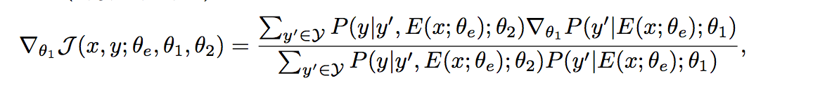

由于$Y$空间很大，所以很难计算，同样的关于$\theta_e,\theta_2$的偏导数也很难计算。为了克服这些困难，采用了基于蒙特卡洛的方法来优化$J(x,y;\theta_e,\theta_1,\theta_2)$的下边界。由于$J$关于$y'$是凹的，可以证明$J(x,y;\theta_e,\theta_1,\theta_2)\gt \tilde J(x,y;\theta_e,\theta_1,\theta_2)$，其中：

$$
\tilde J(x,y;\theta_e,\theta_1,\theta_2)=\sum_{y'\in Y}P(y'|E(x;\theta_e);\theta_1)\log P(y|y',E(x,\theta_e);\theta_2)
$$ (4)

把$\tilde J(x,y;\theta_e,\theta_1,\theta_2)$表示为$\tilde J$，$\tilde J$对于各个参数的梯度如下：

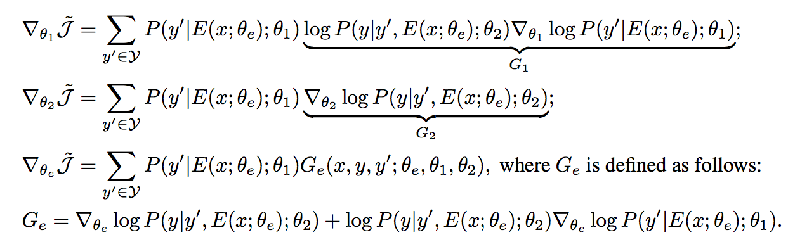

令$\Theta=[\theta_1;\theta_2;\theta_e]$，$G(x,y,y';\Theta)=[G_1;G_2;G_e]$。如果$y'$从分布$P(y'|E(x;\theta_e);\theta_1)$，$G(x,y,y';\Theta)$是$\tilde J$关于$\Theta$梯度的无偏估计。具体算法过程如下：

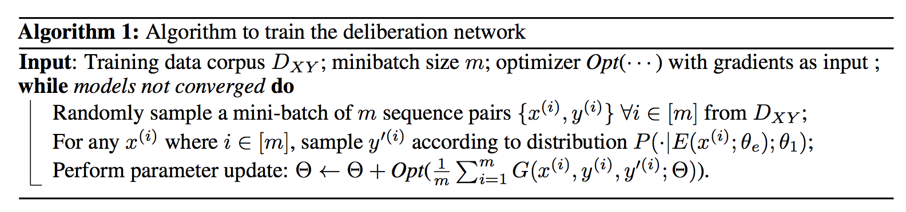

其中$Opt(...)$可以根据具体任务采用不同的优化方法，为了更好采样$y'$，使用束搜索。

## **[Convolutional Sequence to Sequence Learning](https://arxiv.org/pdf/1705.03122.pdf)**

[代码地址](https://github.com/facebookresearch/fairseq)
